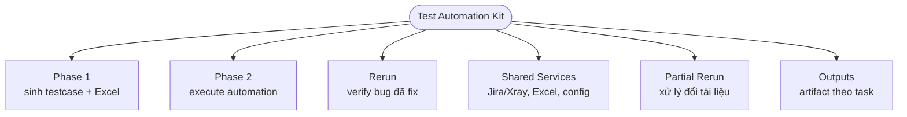
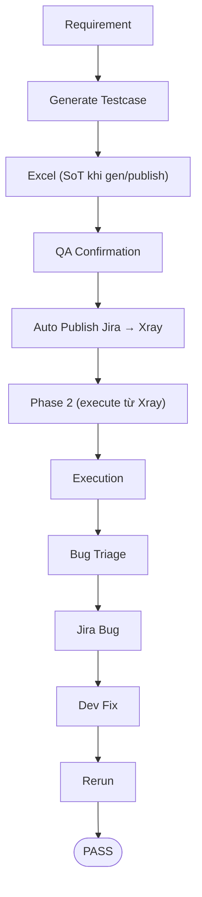
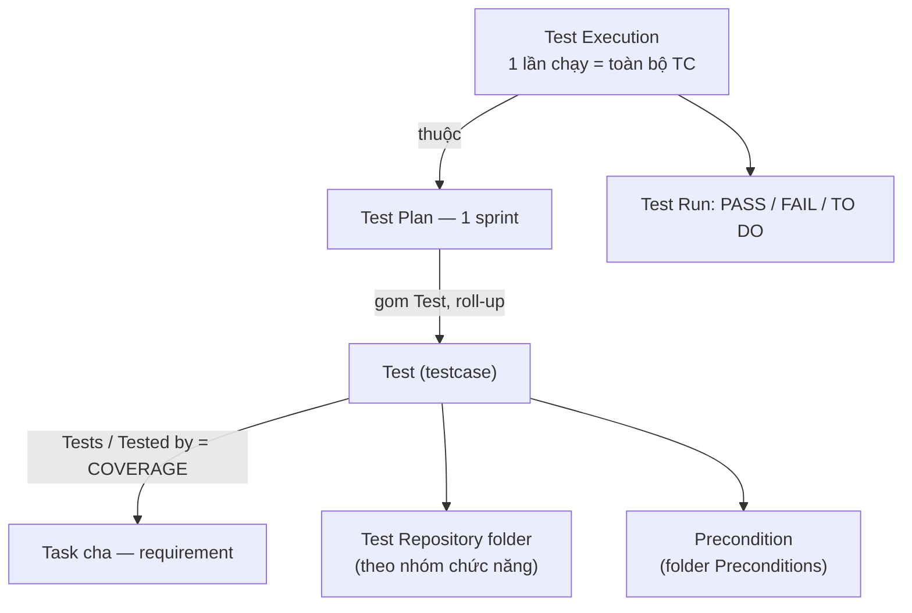

# Test Automation Kit

> Bộ kit dùng để phân tích requirement, sinh testcase, execute automation, triage bug và quản lý evidence theo chuẩn QA automation.

## Overview

Test Automation Kit hỗ trợ quy trình kiểm thử end-to-end cho nhiều project: thu thập requirement, sinh testcase chi tiết, export Excel (source of truth khi gen/publish), publish testcase lên Jira, chạy Playwright/API từ testcase canonical local (Phase 2 mặc định kéo từ Xray), tổng hợp report, triage lỗi và log Jira bug khi đủ điều kiện.

Tài liệu này là landing page của toàn bộ kit. Team QA nên đọc cùng [USER_GUIDE.md](USER_GUIDE.md) và [QUICKSTART.md](QUICKSTART.md) trước khi chạy Phase 1 hoặc Phase 2.

## Architecture



| Layer | Purpose |
|---|---|
| Phase 1 | Đọc requirement/design/API và sinh testcase Markdown + Excel + coverage report + Setup Strategy contract (PRE-NN) + Precondition Execution Matrix; Excel là source of truth **khi gen/publish** và là input cho step publish sau QA confirmation (Phase 2 execute mặc định từ Xray). |
| Jira Testcase Publish | Step riêng trong phạm vi Phase 1: sau khi QA xác nhận Excel, đọc Excel canonical, tạo/cập nhật Xray `Test` issue, nhóm chức năng qua subfolder Test Repository, gắn label tối thiểu (marker `automation-testcase` + khóa dedup `task-*`/`tc-*`) và link về Jira Story/Task như `SAPP-3255` (mặc định không tạo Test Set, không label group/layer/risk/priority). Excel là source of truth khi authoring/publish; Phase 2 execute mặc định lấy nguồn từ Xray (`TESTCASE_SOURCE=xray`). |
| Xray Test Lifecycle Cleanup | Step thuộc nhánh phụ `partial-rerun`: khi Excel thay đổi sau publish và đã qua Human Review, đối chiếu TC ID với Xray `Test`, đánh dấu stale bằng label cleanup, restore active TC nếu cần và chỉ unlink khỏi Story/Task khi QA xác nhận; không hard delete Test issue. |
| Phase 2 | Đọc testcase từ nguồn canonical local (mặc định kéo từ Xray, `TESTCASE_SOURCE=xray`; `excel` là opt-out), chạy Precondition Resolution Pass qua UI/API public-business contract, fixture hoặc test hook nếu có → generate/update Playwright/API spec, execute phần automatable, capture evidence và report. Case cần DB/backend internal state được chuyển manual/semi-auto. |
| Setup Layer | `tests/support/setup/`: factory/hook/fixture/mock/cleanup/contract dùng chung để dựng tiền điều kiện theo contract; không dựng state bằng DB — chỉ read-only verify UAT qua guarded client `db/uatPgClient.ts` (read-only, chỉ SELECT). |
| Rerun | Chạy lại case fail hoặc bug Jira đã fix; không dùng để đồng bộ tài liệu nguồn mới. |
| Shared Services | Jira testcase publisher, Jira bug reporter, Google Sheet, Excel converter, runtime config và helper dùng chung. |
| Partial Rerun | Nhánh phụ độc lập để xử lý thay đổi tài liệu nguồn và execute subset bị ảnh hưởng; không được gọi từ Main Flow. |
| Outputs | Lưu requirement artifacts, testcase, execution results, evidence và reports theo từng task. |

## Quick Start

| Step | Action | Command/File |
|---:|---|---|
| 1 | Cài dependencies | `npm install` |
| 2 | Tạo env local từ template | `.env.example` -> `.env.local` hoặc `.env` |
| 3 | Chạy theo prompt Phase 1/Phase 2 | `prompt_templates/run_phase1_template.md`, `prompt_templates/run_phase2_template.md` |

## Workflow Overview



## Folder Structure

```text
test-automation-kit/
├── .agent/
│   ├── config/
│   ├── workflows/
│   │   ├── phase1_generate_tc.md            # entry Phase 1
│   │   ├── phase1_00_scope_planning.md      # optional: RBT scope + risk register
│   │   ├── phase1_01_prepare_context.md     # gồm Ambiguity Gate (chặn sinh TC khi mơ hồ)
│   │   ├── phase1_02_generate_testcases.md
│   │   ├── phase1_03_validate_export_report.md
│   │   ├── phase1_04_auto_publish_jira.md
│   │   ├── phase2_execute.md                # entry Phase 2
│   │   ├── phase2_01_prepare_execution.md
│   │   ├── phase2_02_generate_or_update_automation.md
│   │   ├── phase2_03_execute_and_auto_heal.md
│   │   ├── phase2_04_report_and_jira_gate.md
│   │   ├── rerun.md                         # entry Re-run
│   │   ├── rerun_01_map_bug_to_testcase.md
│   │   ├── rerun_02_rerun_and_verify.md
│   │   └── rerun_03_update_jira_and_report.md
│   ├── skills/
│   └── rules/
├── prompt_templates/
│   ├── run_phase1_template.md
│   ├── run_phase2_template.md
│   ├── run_phase_re-run_template.md
│   ├── phase1/   # 01 setup → 02 gen testcase → 03 gen test data → 04 publish Jira
│   └── phase2/   # 04 execute FE → 05 execute API → 06 triage → 07 flaky → 08 log bug Jira
├── partial-rerun/
│   ├── run_requirement_prepare_review.md
│   ├── run_requirement_apply_approved.md
│   ├── run_xray_test_cleanup.md
│   └── reference.md
├── scripts/
│   ├── convert_excel/
│   ├── integrations/
│   └── qa/   # công cụ QA chạy thật: dashboard, accessibility, perf, security, load, risk_score/gate, ui_conformance
├── tests/
│   ├── support/setup/   # setup layer dùng chung (factory/hook/fixture/mock/cleanup/contract)
│   ├── mobile-web/       # spec mobile-web (Playwright device emulation)
│   └── load/             # k6 load script (Loại B, opt-in)
├── knowledge/            # bộ nhớ học: bugs/root_causes/locators/historical_execution (+ examples/) — learning loop
├── exploratory/          # nhánh phụ never-auto (charter-based), ngoài Main Flow
├── profiles/
│   └── <TASK_KEY>/task.env   # env động theo task, nạp qua TASK_ENV (tạo bằng npm run profile:create)
├── outputs/
│   └── <YOUR_PROJECT>/tasks/<TASK_KEY>/
├── README.md
├── QUICKSTART.md
└── RULE_GLOBAL.md
```

## Main Components

| Component | Purpose |
|---|---|
| [USER_GUIDE.md](USER_GUIDE.md) | Hướng dẫn sử dụng Test Automation Kit cho Team QA. Bản Confluence: *User Guide_QA Workflow w AI* (space LMS) — đẩy bằng `CONFLUENCE_PAGE_ID=<id> node scripts/integrations/jira/publish_confluence_page.js [--dry-run]`. |
| [CHANGELOG.md](CHANGELOG.md) | Lịch sử thay đổi **kit dùng chung** theo ngày + chủ đề (vấn đề → cách chữa), kèm commit hash. Đọc trước khi nâng cấp kit hoặc khi thấy hành vi lạ sau khi pull. |
| [QUICKSTART.md](QUICKSTART.md) | Onboarding nhanh cho project mới. |
| [RULE_GLOBAL.md](RULE_GLOBAL.md) | Quy tắc chung về ngôn ngữ, bảo mật, output và cleanup. |
| `.agent/workflows/` | Workflow chính dạng flat: mỗi flow gồm 1 file entry (`phase1_generate_tc.md`, `phase2_execute.md`, `rerun.md`) và các step file `*_NN_*.md` cùng thư mục. Step đánh số reset theo từng flow (phase1_01..04, phase2_01..04, rerun_01..03). |
| `.agent/skills/` | Skill instructions cho agent theo vai trò chuyên biệt. |
| `.agent/rules/` | Rule bắt buộc cho core behavior, locator, Playwright FE/API. |
| `prompt_templates/` | Prompt dùng để chạy Phase 1, Phase 2 và rerun. Lưu ý đánh số: prompt con là sub-prompt theo hoạt động, số chạy liên tục theo trình tự pipeline (`phase1/01..04` chuẩn bị→sinh testcase→test data→publish Jira; `phase2/04..08` execute FE→execute API→triage review→flaky→log bug Jira) — KHÁC với workflow `.agent/workflows/` đánh số reset theo từng phase (phase2_01..04). Số prompt không ánh xạ 1:1 với số workflow; chạy từng prompt khi cần đúng hoạt động đó. |
| `partial-rerun/` | Nhánh phụ độc lập; không là dependency của Main Flow và có thể xóa mà Main Flow vẫn chạy. |
| `partial-rerun/run_requirement_prepare_review.md` | Phase 1 của nhánh phụ: tạo diff/impact/testcase draft và dừng chờ Human Review. |
| `partial-rerun/run_requirement_apply_approved.md` | Phase 2 của nhánh phụ: merge testcase đã approve và partial execute. |
| `partial-rerun/run_xray_test_cleanup.md` | Cleanup Jira/Xray testcase mirror sau khi Excel thay đổi trong partial rerun và đã có Human Review approval. |
| `partial-rerun/reference.md` | Rule tham chiếu duy nhất cho nhánh phụ, thay cho nhiều file workflow/prompt/skill rời rạc. |
| `scripts/convert_excel/` | Convert testcase Markdown sang Excel. |
| `scripts/integrations/jira/` | Kiểm tra Jira connection và log bug. |
| `scripts/integrations/google_sheet/` | Tích hợp Google Sheet khi project cần sync/export. |
| `scripts/qa/` | Công cụ QA chạy thật (tái dùng login/catalog): `dashboard_generate` (SAPP DS), `accessibility_check` (axe-core), `perf_check` (Loại A), `security_check` (GET, non-prod), `load_check` (k6 wrapper, Loại B), `risk_score`/`risk_gate` (RBT), `ui_conformance_check`. **Forcing functions (round-3):** `preflight_gate` (miss-file), `output_gate` (execute/gen/bug), `design_gate` (thiết kế TC), `self_review` (checklist gộp), `hooks/` (SessionStart inject + PostToolUse gate) — non-negotiables ở `CLAUDE.md`, verdict/rerun ở `.agent/config/verdict_taxonomy.json`. Xem `scripts/qa/README.md`. |
| `.github/workflows/` + `.gitlab-ci.yml` | CI/CD: `static-check` mỗi push/MR (node --check + validate JSON + dry-run an toàn, **không secret**); `integration-check`/`task-execute`/regression chạy **manual/nightly** (cần secret, hit UAT). Không auto-publish (human gate). Chi tiết trigger/secrets/an toàn: [.github/workflows/README.md](.github/workflows/README.md). GitHub và GitLab là 2 bản tương đương — dùng một, xoá bản kia. |
| `scripts/ci/` | `set-gitlab-variables.sh`: khai CI Variables lên GitLab từ `.env.local` qua `glab` (mặc định dry-run, `--apply` để set thật; secret set masked+protected, không in giá trị). |
| `knowledge/` | Bộ nhớ học (learning loop): bug/root cause/locator heal/snapshot pass-fail đã qua gate → nguồn cho RBT + dashboard. **Thu TỰ ĐỘNG**: reporter `learn_reporter` chạy sau mỗi `playwright test` → `learn_task.js` (KPI + snapshot theo module); bug nạp bằng `learn_bugs.js` (lấy từ Jira theo label `auto-bug`). `knowledge/examples/` là dữ liệu mẫu; `knowledge/` live khởi tạo rỗng. |
| `scripts/utils/ui/ensure_expanded.js` | Mở panel/accordion ổn định trên DOM "nhiều icon giống nhau": thử ứng viên + nghiệm thu bằng sentinel, tự Escape khi click nhầm modal/dropdown, idempotent. Thay cho click toạ độ chevron (nguồn flaky kinh điển). Regression: `tests/fe/infra/ensure-expanded.spec.ts`. |
| `tests/fe/support/auth/tokenBroker.ts` | Token Broker: giữ 1 phiên SPA đã login sống → lấy token **tươi** mỗi lần gọi API, 401/403 tự refresh + retry ⇒ execute không đứt vì bearer hết hạn, `task.env` chỉ cần user/password (OPS và LMS). |
| `exploratory/` | Nhánh phụ độc lập (never-auto, charter-based) — dò rủi ro ngoài testcase đã review; draft phải qua `tc_validator` mới tính coverage. |
| `tests/support/setup/` | Setup layer dùng chung: factory/hook/fixture/mock/cleanup/contract cho Precondition Resolution Pass (xem `tests/support/setup/README.md`). |
| `profiles/` | Env động theo từng task (`profiles/<TASK_KEY>/task.env`, nạp qua `TASK_ENV`); giá trị tĩnh vẫn ở `.env` chung. Tạo bằng `npm run profile:create -- <TASK_KEY>`. |
| `outputs/` | Artifact theo project/task, không hardcode theo một project cụ thể. |

## Execution Flow

| Phase | Input | Output | Gate |
|---|---|---|---|
| Phase 1 | Jira, Confluence, Figma, Swagger, file local | Testcase Markdown, Excel source of truth (khi gen/publish), coverage summary, Setup Strategy contract, Precondition Execution Matrix, `task.md` | Coverage/risk review đủ rõ; mọi precondition có contract auto/manual rõ. |
| Jira Testcase Publish | Excel source of truth + QA confirmation | Xray `Test` issues/mirror + publish summary | Step riêng trong Phase 1; publish thật chỉ sau khi QA approve. |
| Xray Test Cleanup | Excel source of truth sau partial rerun + Human Review/QA cleanup confirmation | Cleanup summary; stale Test được label deprecated/out-of-scope/stale-from-excel; optional unlink | Nhánh phụ `partial-rerun`, không hard delete Xray Test issue. |
| Phase 2 | Testcase canonical local (mặc định Xray via `TESTCASE_SOURCE=xray`; Excel là opt-out), Setup Strategy contract, env, app/API URLs, credentials | Playwright results, evidence, execution summary | Execute phần đủ điều kiện qua UI/API; phần cần DB/backend state ghi manual/semi-auto; `setup_failure`/`BLOCKED_SETUP`/`SKIP_SETUP` không log Jira. |
| Bug Triage | Failed testcase, logs, screenshot/video | Bug candidate hoặc non-product issue | Không log Jira nếu fail do setup/prompt/test data. |
| Jira Logging | Confirmed product/API bug | Jira sub-bug + ảnh/video evidence | Có expected, actual, reproduce steps và evidence rõ. |
| Rerun | Bug/case fail đã fix hoặc cần verify | Rerun report, Jira Done nếu PASS thật | Có evidence PASS ảnh/video nếu chuyển Jira sang Done. |

## Xray Traceability Model

Team chạy **toàn bộ testcase của 1 task cùng lúc** → **KHÔNG dùng Test Set**. Mô hình 5 lớp (chi tiết + vòng đời status ở [USER_GUIDE §5.5.0](USER_GUIDE.md)):



- **Giữ per-test coverage link** (`XRAY_REQUIREMENT_LINK_ENABLED=1`) — độ phủ xem ở panel "Test Coverage" của Task.
- **Không Test Set** (`XRAY_TEST_SET_ENABLED=0`); tổ chức bằng **Test Repository folder** (subfolder theo nhóm chức năng) + folder **Preconditions**.
- **Status**: Test để Open (status = biên soạn, không phải kết quả); Test Plan → Done cuối sprint; Sub-bug → Done khi verify PASS.
- **Coverage trống dù đã link?** Cần đủ 2 điều kiện: (1) chiều link đúng — payload `{inwardIssue: Test, outwardIssue: requirement}` (kit đặt sẵn qua `XRAY_REQUIREMENT_LINK_DIRECTION=test_to_story`; Test ở slot `inwardIssue`/nhãn "is tested by", nhãn đọc ngược trực giác nên bám theo slot); (2) requirement issue type nằm trong Xray **"Coverable Issue Types"** (admin cấu hình). Chi tiết + cách kiểm tra ở [USER_GUIDE §5.5.0](USER_GUIDE.md).

## Common Commands

| Task | Command |
|---|---|
| Install dependencies | `npm install` |
| Install Playwright browsers | `npx playwright install` |
| Run all Playwright tests | `npm test` |
| Run FE tests | `npm run test:fe` |
| Run API tests | `npm run test:api` |
| Run task-scoped Playwright safely | `npm run test:task -- --project-output <PROJECT_OUTPUT_DIR> --task <TASK_KEY>` |
| Run task-scoped FE safely | `npm run test:task:fe -- --project-output <PROJECT_OUTPUT_DIR> --task <TASK_KEY>` |
| Run task-scoped API safely | `npm run test:task:api -- --project-output <PROJECT_OUTPUT_DIR> --task <TASK_KEY>` |
| Show report helper | `npm run report` |
| QA Dashboard (SAPP DS) | `npm run dashboard` |
| Accessibility (axe-core) | `npm run accessibility -- --catalog <ui_catalog.json>` |
| Performance Loại A (đo, so ngưỡng) | `npm run perf -- --catalog <perf_catalog.json>` |
| Security basic (GET, non-prod) | `npm run security -- --catalog <security_catalog.json> --confirm-nonprod` |
| Load Loại B (k6, non-prod) | `npm run load -- --script tests/load/example.load.js --confirm-nonprod --docker` |
| Điểm Lighthouse qua CDP (opt-in nặng) | `npm run lighthouse -- --catalog <lighthouse_catalog.json> --confirm-nonprod` |
| Cross-browser lane (nightly/manual) | `CROSS_BROWSER=1 npx playwright test --project=firefox-desktop --project=webkit-desktop` |
| Thu learning data 1 task (tự chạy sau mỗi test run) | `TASK_ENV=profiles/<TASK>/task.env npm run learn` |
| Backfill learning data từ task cũ | `npm run learn:backfill` |
| Nạp bug Jira vào knowledge (sau khi log bug) | `TASK_ENV=profiles/<TASK>/task.env npm run learn:bugs:apply` |
| Chọn test theo diff + risk/flaky | `npm run select:tests -- [--include-risky 3] [--risk-first]` |
| Risk register (RBT) | `npm run risk` |
| Risk gate (cảnh báo / chặn CI) | `npm run risk:gate` · `npm run risk:gate:enforce` |
| Preflight — input/config đủ (G1) | `npm run preflight` · `node scripts/qa/preflight_gate.js --mode phase2 --task <TASK_KEY>` |
| Design gate — thiết kế TC (G5) | `npm run design:gate -- --dir <test-cases/> --with-rows` |
| Output gate — execute / gen-testcase (G2/G4/G6) | `npm run gate:output -- --status <status.json>` · `npm run gate:gen-testcase -- --dir <test-cases/>` |
| Self-review — checklist gộp trước finalize (G9) | `npm run self-review -- --task <TASK_KEY>` |
| Dependency graph — REQ→TC→exec + impact-map (P2) | `npm run dep:graph -- --task <TASK_KEY> [--changed a,b]` |
| Quality decision — GO/NO-GO (P2) | `npm run quality:decision -- --task <TASK_KEY> [--coverage N] [--gate PASS/WARN/FAIL]` |
| Mobile-web (device emulation) | `npm run test:mobile-web` |
| Seed knowledge từ lịch sử Jira/Xray | `npm run seed:knowledge` · `npm run seed:knowledge:apply -- --since <YYYY-MM-DD>` |
| KPI/reliability (thường do `npm run learn` gọi) | `npm run metrics:collect -- --results <results.json>` · `npm run reliability` |
| Output gate — tự sửa lỗi format | `npm run gate:output:fix -- --status <status.json>` |
| Gate policy-source (rule 1 nguồn) | `npm run gate:policy` |
| Inventory gate — chống false-green (F1) | `npm run inventory:gate` |
| Secret scan / audit dependency CI | `npm run secret:scan` · `npm run audit:ci` |
| Traceability matrix REQ→TC→exec | `npm run trace:matrix -- --task <TASK_KEY>` |
| Lint / typecheck | `npm run lint` · `npm run typecheck` |
| Regenerate user-guide images | `npm run user-guide:images` |
| Check Jira connection | `npm run integration:check` |
| Check Jira connection live | `npm run integration:check:live` |
| Dry-run publish testcase Jira | `npm run jira:testcase-publish:dry-run -- --task <TASK_KEY> --story <JIRA_STORY_KEY> --project-output <PROJECT_OUTPUT_DIR>` |
| Publish testcase Jira | `npm run jira:testcase-publish -- --task <TASK_KEY> --story <JIRA_STORY_KEY> --project-output <PROJECT_OUTPUT_DIR> --publish --qa-approved` |
| Publish testcase Jira kèm Test Set | `npm run jira:testcase-publish -- --task <TASK_KEY> --story <JIRA_STORY_KEY> --project-output <PROJECT_OUTPUT_DIR> --publish --qa-approved --with-test-sets` |
| Dry-run partial rerun cleanup Xray Tests | `npm run jira:testcase-cleanup:dry-run -- --task <TASK_KEY> --story <JIRA_STORY_KEY> --project-output <PROJECT_OUTPUT_DIR>` |
| Apply partial rerun cleanup Xray Tests | `npm run jira:testcase-cleanup -- --task <TASK_KEY> --story <JIRA_STORY_KEY> --project-output <PROJECT_OUTPUT_DIR> --apply --qa-approved` |
| Dry-run Jira bug reporter | `npm run jira:bug-report:dry-run -- --task <TASK_KEY> --story <JIRA_STORY_KEY> --project-output <PROJECT_OUTPUT_DIR>` |
| Create Jira bug after approval | `npm run jira:bug-report -- --task <TASK_KEY> --story <JIRA_STORY_KEY> --project-output <PROJECT_OUTPUT_DIR>` |

## Output Structure

Mọi artifact của task phải nằm dưới:

```text
<PROJECT_OUTPUT_DIR>/tasks/<TASK_KEY>/
```

| Folder | Content |
|---|---|
| `requirements/` | Jira, Confluence, Figma, Swagger hoặc tài liệu đầu vào đã fetch/cache. |
| `test-cases/` | Testcase Markdown, Excel và snapshot context. |
| `test-results/` | Playwright JSON, HTML report, screenshot, video, trace và artifact execute. |
| `reports/` | Phase summary, Jira testcase publish summary, execution summary, Jira compare, bug log hoặc rerun report. |
| `change/` | Artifact của nhánh phụ Requirement Change Management nếu user gọi thủ công. |
| `logs/` | Local logs đã sanitize nếu workflow có sinh ra. |

## Best Practices

- ✅ Dùng `PROJECT_OUTPUT_DIR=outputs/<YOUR_PROJECT>` và `TASK_KEY=<TASK_KEY>` cho mọi output.
- ✅ Echo `PROJECT_OUTPUT_DIR`, `TASK_KEY`, `TASK_OUTPUT_DIR` trước khi ghi file hoặc chạy command.
- ✅ Dùng `RUN_ID` khi chạy song song nhiều session cùng một `TASK_KEY`.
- ✅ Với Phase 2 song song nhiều story, ưu tiên automation story-specific dưới `<PROJECT_OUTPUT_DIR>/tasks/<TASK_KEY>/automation/`.
- ✅ Khi chạy Playwright cho task cụ thể, ưu tiên `npm run test:task* -- --project-output ... --task ...` thay vì gọi `npm test` trực tiếp.
- ✅ Chạy từng story theo phase rời nhau: Phase 1, chờ Dev implement, Phase 2, chờ Dev fix nếu có, rồi Re-run.
- ✅ Sau QA confirmation trong Phase 1, publish testcase lên Jira từ Excel canonical; Phase 2 execute mặc định lấy nguồn từ Xray (`TESTCASE_SOURCE=xray`, kéo về canonical local), `excel` là opt-out.
- ✅ Chạy Auto Publish Jira bằng prompt riêng `prompt_templates/phase1/04_auto_publish_jira.md` sau khi QA xác nhận Excel.
- ✅ Nếu cần quản lý trên Xray theo luồng nghiệp vụ, bật optional Test Set bằng `--with-test-sets`; nhóm lấy từ business flow chính trong cột `Module`.
- ✅ Khi testcase đã publish nhưng Excel bỏ bớt TC sau partial rerun, chạy cleanup dry-run rồi apply theo prompt `partial-rerun/run_xray_test_cleanup.md`; không xóa cứng Xray Test.
- ✅ Giữ testcase đủ precondition, test data, steps, expected result và assertion intent.
- ✅ Review coverage bằng requirement/risk gate, không chỉ dựa vào số lượng testcase.
- ✅ Capture screenshot hoặc video không trắng cho bug phức tạp.
- ✅ Dùng dry-run trước khi tạo Jira bug thật.
- ⚠️ Không commit `.env`, `.env.local`, token, password, cookie, private key hoặc service-account JSON.
- ⚠️ Không hardcode URL, credential, project key, module name hoặc output path theo task cụ thể.
- ⚠️ Không sửa `.env`/`.env.local` chung khi có session khác đang chạy; truyền env theo command.
- ⚠️ Không sửa shared helper/config/spec core khi story khác đang execute nếu chưa có xác nhận đây là thay đổi chung.
- ❌ Không skip testcase chỉ để tăng pass rate.
- ❌ Không sửa expected result nếu chưa có requirement/API/design xác nhận.

## Why It Matters

Kit này được thiết kế để AI Agent và QA cùng đọc được cùng một nguồn sự thật. Cấu trúc output nhất quán giúp giảm token khi rerun, giảm lỗi setup, tăng khả năng audit và giúp QA Lead review coverage/risk nhanh hơn.

## References

| Document | Purpose |
|---|---|
| [USER_GUIDE.md](USER_GUIDE.md) | Hướng dẫn sử dụng cho Team QA. |
| [QUICKSTART.md](QUICKSTART.md) | Setup và chạy lần đầu. |
| [RULE_GLOBAL.md](RULE_GLOBAL.md) | Quy tắc vận hành bắt buộc. |
| [prompt_templates/run_phase1_template.md](prompt_templates/run_phase1_template.md) | Prompt chạy Phase 1 dùng chung. |
| [prompt_templates/phase1/04_auto_publish_jira.md](prompt_templates/phase1/04_auto_publish_jira.md) | Prompt riêng cho step Auto Publish Jira trong Phase 1 sau QA confirmation. |
| [prompt_templates/run_phase2_template.md](prompt_templates/run_phase2_template.md) | Prompt chạy Phase 2 dùng chung. |
| [prompt_templates/run_phase_re-run_template.md](prompt_templates/run_phase_re-run_template.md) | Prompt canonical để chạy Re-run bug/case fail và cập nhật Jira bug đã fix. |
| [partial-rerun/run_requirement_prepare_review.md](partial-rerun/run_requirement_prepare_review.md) | Prompt Phase 1 cho nhánh phụ khi nội dung tài liệu requirement/design/API thay đổi. |
| [partial-rerun/run_requirement_apply_approved.md](partial-rerun/run_requirement_apply_approved.md) | Prompt Phase 2 sau khi Human Review approve. |
| [partial-rerun/run_xray_test_cleanup.md](partial-rerun/run_xray_test_cleanup.md) | Prompt cleanup Xray Test mirror sau khi partial rerun làm Excel thay đổi. |
| [partial-rerun/reference.md](partial-rerun/reference.md) | Rule chi tiết của nhánh phụ partial rerun. |
