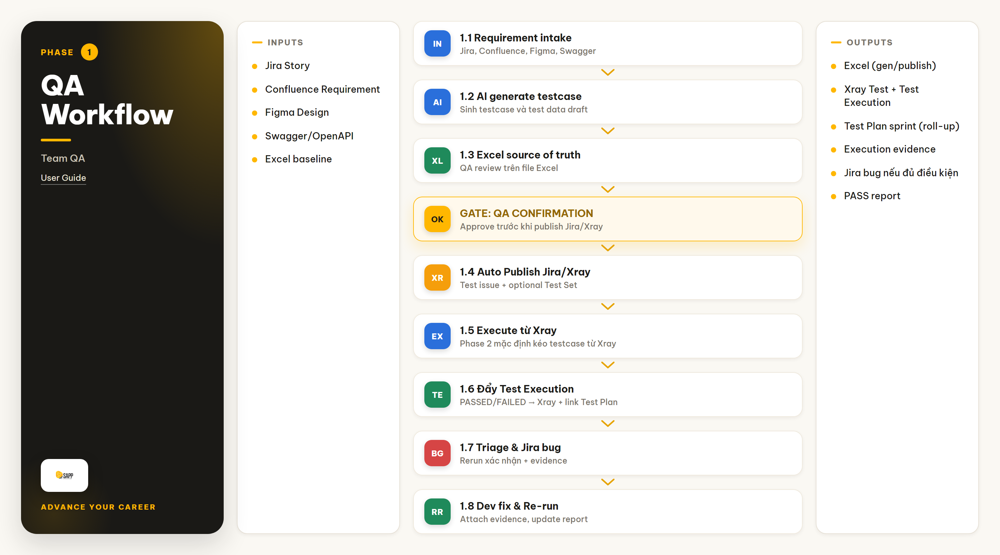
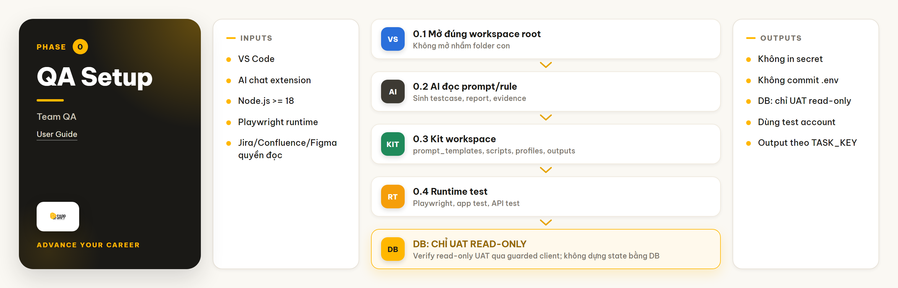
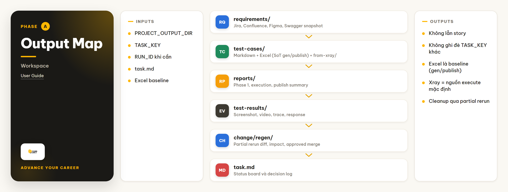
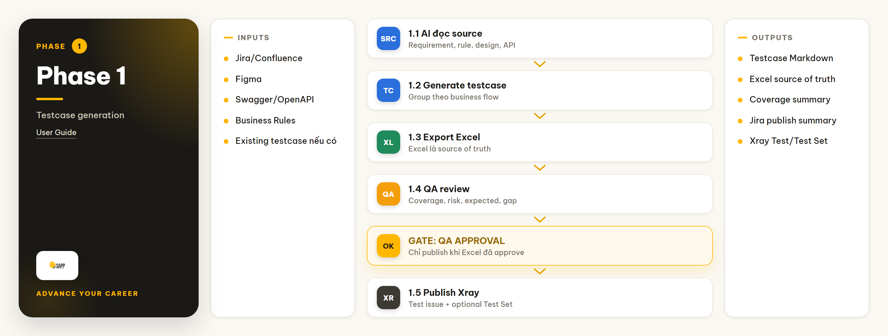
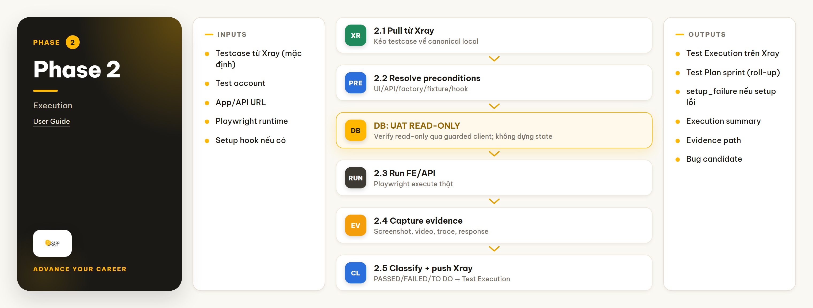
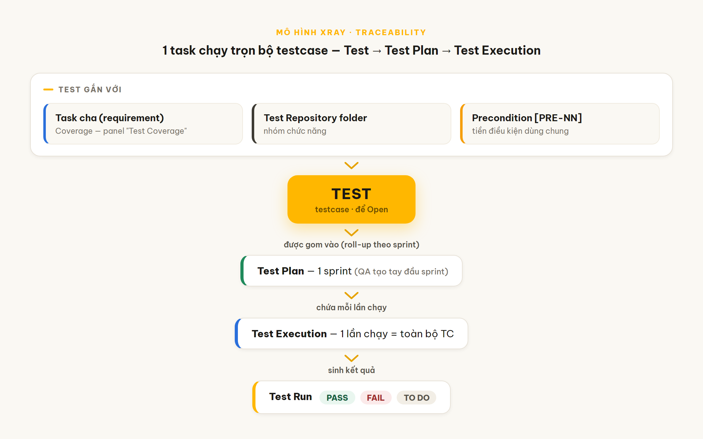
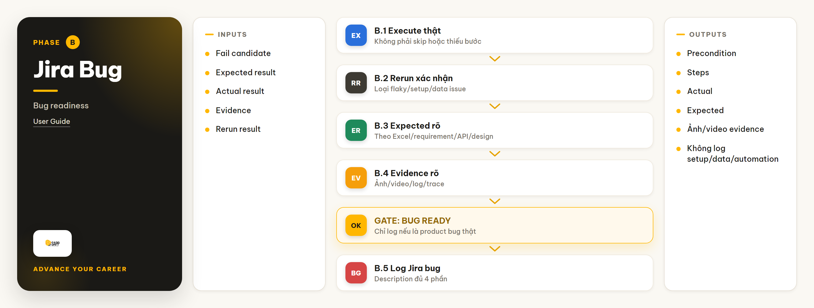
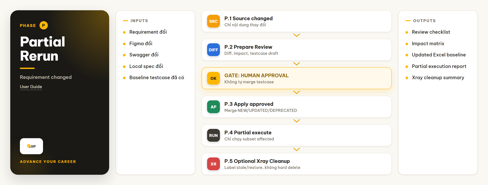
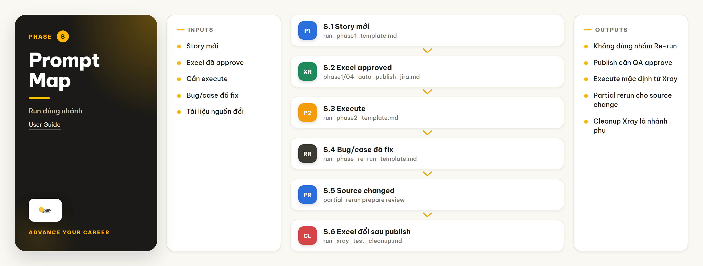
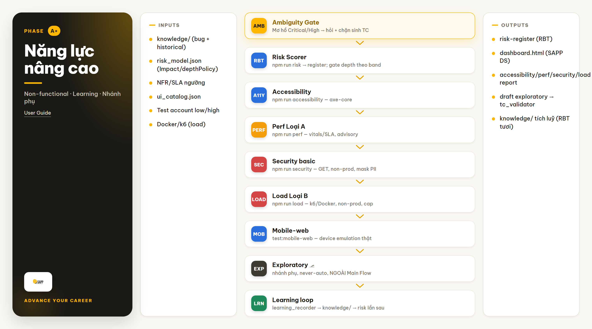

# Hướng dẫn sử dụng Test Automation Kit cho Team QA

> Tài liệu hướng dẫn Team QA sử dụng Test Automation Kit trong Visual Studio Code để sinh testcase, execute automation, review coverage/risk, log bug Jira và re-run sau khi Dev fix.

## Mục lục

- [1. Tổng quan](#1-tổng-quan)
- [2. Ai dùng tài liệu này?](#2-ai-dùng-tài-liệu-này)
- [3. Chuẩn bị trước khi chạy](#3-chuẩn-bị-trước-khi-chạy)
- [4. Cấu trúc thư mục cần biết](#4-cấu-trúc-thư-mục-cần-biết)
- [5. Quy trình sử dụng chính](#5-quy-trình-sử-dụng-chính)
- [6. Nhánh phụ khi tài liệu thay đổi](#6-nhánh-phụ-khi-tài-liệu-thay-đổi)
- [7. Cách QA Lead review kết quả](#7-cách-qa-lead-review-kết-quả)
- [8. Chạy song song nhiều story](#8-chạy-song-song-nhiều-story)
- [9. Prompt và command thường dùng](#9-prompt-và-command-thường-dùng)
- [10. Lỗi thường gặp và cách xử lý](#10-lỗi-thường-gặp-và-cách-xử-lý)
- [11. Phụ lục](#11-phụ-lục)
- [12. Năng lực nâng cao (Non-functional · Learning · Nhánh phụ)](#12-năng-lực-nâng-cao-non-functional--learning--nhánh-phụ)

## 1. Tổng quan

### 1.1 Test Automation Kit dùng để làm gì?

Test Automation Kit hỗ trợ QA làm việc theo từng story/task:

```text
Requirement
-> Sinh testcase (Excel source of truth)
-> QA review/confirmation
-> Auto publish testcase lên Jira/Xray
-> Execute automation (mặc định đọc testcase từ Xray)
-> Đẩy trạng thái PASS/FAIL lên Xray (Test Execution) + gắn Test Plan
-> Triage bug
-> Log Jira nếu đủ điều kiện
-> Re-run sau khi Dev fix
```

Kit không thay thế vai trò review của Team QA. AI Agent hỗ trợ đọc tài liệu, tạo testcase, chạy test và tổng hợp report; QA vẫn là người quyết định coverage có đủ, risk có chấp nhận được và bug có đủ điều kiện log Jira hay chưa.

### 1.2 Main Flow của kit



Main Flow hiện tại:

```text
Phase 1
-> Excel source of truth
-> Review / QA Confirmation
-> Auto Publish testcase lên Jira/Xray
-> Phase 2 Execute (mặc định đọc testcase từ Xray)
-> Đẩy Test Execution (PASS/FAIL/TO DO) lên Xray + gắn Test Plan sprint
-> Validation
-> Jira Bug
-> Dev Fix
-> Re-run
-> PASS
```

Ý nghĩa từng phase:

| Phase | Mục tiêu | Output chính | Ai review |
|---|---|---|---|
| Phase 1 | Sinh testcase từ Jira/Confluence/Figma/Swagger và export Excel source of truth. Auto Publish Jira là step riêng trong Phase 1 sau khi QA xác nhận. | Testcase Markdown, Excel, coverage report, Jira publish summary nếu đã chạy step publish. | QA Member, QA Lead. |
| Review | Kiểm tra coverage, risk và chất lượng testcase. | Quyết định có chạy Phase 2 chưa. | QA Member, QA Lead. |
| Phase 2 | Execute automation thật (mặc định đọc testcase từ Xray), giảm skip/fail sai, rồi đẩy trạng thái lên Xray dưới dạng Test Execution. | Execution summary, evidence, result, Test Execution + Test Plan trên Xray. | QA Member, Automation, QA Lead khi cần. |
| Jira Bug | Log bug khi fail là product bug thật. | Jira bug + evidence ảnh/video. | QA Member, QA Lead. |
| Re-run | Chạy lại bug/case fail sau khi Dev fix. | Rerun report, evidence PASS/FAIL. | QA Member, QA Lead khi cần. |

### 1.3 Nguyên tắc quan trọng nhất

| Nguyên tắc | Lý do |
|---|---|
| Không chạy nhầm `TASK_KEY`. | Tránh ghi đè output của story khác. |
| Không chạy Phase 2 khi Phase 1 chưa được review. | Tránh execute sai expected result. |
| Execute mặc định đọc testcase từ Xray (`TESTCASE_SOURCE=xray`); Excel là source-of-truth khi gen/publish. | Đặt `TESTCASE_SOURCE=excel` nếu muốn chạy thuần Excel local (chưa publish/offline). |
| Không skip case để làm đẹp pass rate. | Report phải phản ánh chất lượng thật. |
| Không log Jira bug nếu fail do setup/test data/automation. | Tránh tạo noise cho Dev. |
| Không đổi expected result nếu chưa có source xác nhận. | Tránh biến product bug thành pass ảo. |
| Evidence bug phải là ảnh/video. | QA Lead và Dev dễ kiểm chứng lỗi. |

## 2. Ai dùng tài liệu này?

| Vai trò | Nên đọc phần nào | Mục tiêu |
|---|---|---|
| QA Member | Toàn bộ tài liệu, đặc biệt phần 3, 5, 8, 9, 10. | Setup môi trường, chạy từng phase và kiểm tra output. |
| QA Lead | Phần 5, 7, 8, 11. | Review coverage, risk, execution quality và bug readiness. |
| Automation Engineer | Phần 3, 4, 5, 8, 9, 10. | Biết điểm chạm automation, evidence, report và re-run. |

File tổng quan quan trọng nhất để Team QA theo dõi trạng thái story là:

```text
outputs/<project>/tasks/<TASK_KEY>/task.md
```

## 3. Chuẩn bị trước khi chạy

### 3.1 Bộ công cụ cần cài



| Công cụ | Bắt buộc với ai | Dùng để làm gì |
|---|---|---|
| Visual Studio Code | QA Member, QA Lead, Automation | Mở workspace, đọc/sửa Markdown, chạy terminal và dùng AI chat extension. |
| AI chat extension trên VS Code | QA Member, QA Lead, Automation | Gọi AI Agent đọc prompt, sinh testcase, execute, triage và cập nhật report. |
| Claude Code hoặc AI Agent tương đương | QA Member, QA Lead, Automation | Chat với AI trong workspace. Team có thể dùng Claude Code hoặc công cụ đã được cấp quyền nội bộ. |
| Git client | QA Member, QA Lead, Automation | Pull kit mới nhất và push thay đổi lên GitLab/GitHub nếu team yêu cầu. |
| Node.js `>=18` | QA Member, Automation | Chạy script, Playwright và converter Excel. |
| Playwright browser runtime | QA Member, Automation | Execute UI/API automation và tạo evidence. |
| Docker **hoặc** k6 (optional) | Automation | Chỉ cần khi chạy **load test Loại B** (`npm run load`); thiếu thì lệnh tự bỏ qua. Xem mục 12. |
| Quyền Jira/Confluence/Figma/Swagger | QA Member, QA Lead | Đọc requirement/design/API source theo từng story/task. |
| Credential app/API test | QA Member, Automation | Login app, gọi API và tạo/rollback test data. |

QA Member và Automation Engineer cần setup đầy đủ để execute. QA Lead nếu chỉ review report thì không bắt buộc cài Playwright.

### 3.2 Cài Visual Studio Code và AI chat extension

QA dùng VS Code làm nơi mở kit và làm việc với AI Agent.

| Bước | Thao tác |
|---:|---|
| 1 | Cài Visual Studio Code từ trang chính thức hoặc bộ cài nội bộ của team. |
| 2 | Mở VS Code, vào `Extensions`. |
| 3 | Cài AI chat extension team đang dùng, ví dụ Claude Code hoặc extension nội bộ tương đương. |
| 4 | Đăng nhập bằng account/API key được cấp. |
| 5 | Mở root folder của kit, không mở nhầm folder con. |
| 6 | Gửi thử một câu ngắn trong AI chat để kiểm tra AI đọc được workspace. |

Yêu cầu với AI chat extension:

| Yêu cầu | Ghi chú |
|---|---|
| Đọc file trong workspace | Cần để đọc prompt, testcase, report. |
| Ghi file trong workspace | Cần để cập nhật output. |
| Chạy command khi được phép | Cần cho export Excel, Playwright, integration check. |
| Không in secret ra chat/log | Bắt buộc. |
| Kết nối MCP/connector nếu có | Dùng cho Jira/Confluence/Figma khi team cấu hình. |

### 3.3 Cấu hình MCP server

MCP server giúp AI Agent kết nối trực tiếp với Jira, Confluence, Figma, HubSpot test account hoặc Playwright. Nếu team không dùng MCP, QA vẫn có thể chạy kit bằng link, file export hoặc script integration hiện có; tuy nhiên MCP giúp AI đọc source nhanh và ổn định hơn.

File template MCP của kit:

```text
.agent/config/mcp_config.md
```

Các MCP server thường dùng:

| Server | Dùng để làm gì | Khi nào cần |
|---|---|---|
| `atlassian` | Đọc Jira và Confluence. | Phase 1 cần lấy story, requirement hoặc tài liệu BA trực tiếp. |
| `figma` | Đọc Figma design. | Scope có UI/design cần đối chiếu field, flow, validation. |
| `hubspot` | Đọc dữ liệu CRM HubSpot test. | Scope cần kiểm tra contact, company, deal, owner, pipeline hoặc metadata CRM. |
| `playwright` | Inspect browser qua MCP. | Cần hỗ trợ đọc UI runtime, locator hoặc debug interaction. |

#### 3.3.1 Cấu hình HubSpot hiện tại

Kit hiện chỉ dùng HubSpot test account cho MCP/automation. Không dùng HubSpot production account trong luồng QA thường ngày.

Block env cần có:

```env
HUBSPOT_ENV=test
HUBSPOT_BASE_URL=https://api.hubapi.com
HUBSPOT_UI_DOMAIN=app.hubspot.com
HUBSPOT_PORTAL_ID=<TEST_PORTAL_ID>
HUBSPOT_ACCESS_TOKEN=<TEST_PRIVATE_APP_ACCESS_TOKEN>
HUBSPOT_MCP_PACKAGE=@hubspot/mcp-server@0.4.0
```

Ý nghĩa từng biến:

| Biến | Ý nghĩa |
|---|---|
| `HUBSPOT_ENV` | Luôn để `test` trong kit. |
| `HUBSPOT_BASE_URL` | API base URL của HubSpot, dùng `https://api.hubapi.com`. |
| `HUBSPOT_UI_DOMAIN` | Domain web UI của HubSpot, dùng `app.hubspot.com`. |
| `HUBSPOT_PORTAL_ID` | Portal/account ID của HubSpot test account. |
| `HUBSPOT_ACCESS_TOKEN` | Private App access token của HubSpot test account. |
| `HUBSPOT_MCP_PACKAGE` | Package MCP hiện dùng: `@hubspot/mcp-server@0.4.0`. |

#### 3.3.2 Auth HubSpot CLI

HubSpot MCP hiện cần HubSpot CLI config. Nếu gặp lỗi `Config file not found, run hs account auth to configure your account`, chạy auth bằng HubSpot CLI.

```powershell
npx -y -p @hubspot/cli hs account auth --account <TEST_PORTAL_ID> --name "<TEST_ACCOUNT_NAME>" --default
```

Sau khi auth xong, file config local được tạo tại:

```text
C:\Users\<USER>\.hscli\config.yml
```

Kiểm tra account đã auth:

```powershell
npx -y -p @hubspot/cli hs account list
```

Đọc thử 1 contact bằng HubSpot CLI:

```powershell
npx -y -p @hubspot/cli hs api "/crm/v3/objects/contacts?limit=1" --account <TEST_PORTAL_ID> --json
```

#### 3.3.3 Setup MCP local

Các bước cấu hình MCP:

| Bước | Thao tác |
|---:|---|
| 1 | Mở `.agent/config/mcp_config.md` và copy block JSON template. |
| 2 | Dán JSON vào MCP settings local của VS Code/AI extension đang dùng. |
| 3 | Đảm bảo `HUBSPOT_ACCESS_TOKEN` nằm trong `.env`, `.env.local` hoặc MCP settings local; không ghi token vào Markdown dùng chung. |
| 4 | Chạy `hs account auth` nếu máy chưa có `C:\Users\<USER>\.hscli\config.yml`. |
| 5 | Reload VS Code hoặc restart AI chat extension để MCP server được load lại. |
| 6 | Yêu cầu AI kiểm tra MCP HubSpot bằng cách đọc thử 1 contact với `limit=1`, không in token ra output. |

Nếu dùng HubSpot CLI setup MCP theo client:

```powershell
npx -y -p @hubspot/cli hs mcp setup --client vscode
```

Với Codex:

```powershell
npx -y -p @hubspot/cli hs mcp setup --client codex
```

#### 3.3.4 Nguyên tắc bảo mật

| Rule | Lý do |
|---|---|
| Chỉ dùng HubSpot test account cho kit. | Tránh đọc/ghi nhầm dữ liệu production. |
| Không commit MCP settings chứa secret. | Tránh lộ token/API key. |
| Không paste token vào chat hoặc report. | Tránh lộ secret trong log. |
| Không sửa `.agent/config/mcp_config.md` bằng token thật. | File này là template dùng chung. |
| Token bị lộ phải rotate ngay. | Token cũ không còn an toàn. |

#### 3.3.5 Lỗi thường gặp

| Lỗi | Nguyên nhân hay gặp | Cách xử lý |
|---|---|---|
| `Config file not found` | Chưa auth HubSpot CLI. | Chạy `npx -y -p @hubspot/cli hs account auth --account <TEST_PORTAL_ID> --default`. |
| MCP server không start | Node.js thiếu, package không tải được hoặc command sai theo OS. | Kiểm tra `node -v`, `npm -v`, reload VS Code và xem MCP log của extension. |
| Không đọc được Jira/Confluence | Token sai, user thiếu quyền hoặc URL sai. | Kiểm tra lại `JIRA_*`, `CONFLUENCE_*` và quyền truy cập page/issue. |
| Không đọc được Figma | `FIGMA_API_KEY` thiếu quyền hoặc link/node sai. | Kiểm tra quyền file Figma và token. |
| Không đọc được HubSpot | Token thiếu scope, CLI auth sai account hoặc MCP chưa reload. | Kiểm tra `HUBSPOT_*`, `hs account list`, scope Private App và MCP server log. |
| AI vẫn không thấy MCP | Chưa reload IDE hoặc MCP settings đặt sai scope. | Reload VS Code, mở lại workspace root và kiểm tra MCP server list trong extension. |

### 3.4 Đồng bộ kit bằng GitLab/GitHub

Nếu kit được quản lý trên GitLab/GitHub, QA cần biết pull/push cơ bản.

Trước khi bắt đầu làm việc:

```bash
git pull
```

Sau khi sửa tài liệu/prompt/script và cần đẩy lên repo:

```bash
git status
git add <file-da-sua>
git commit -m "docs: update qa user guide"
git push
```

Quy tắc:

| Quy tắc | Lý do |
|---|---|
| Pull trước khi sửa | Tránh làm việc trên version cũ. |
| Không commit `.env` hoặc secret | Tránh lộ token/password. |
| Không commit artifact lớn nếu team không yêu cầu | Tránh làm repo nặng. |
| Resolve conflict cẩn thận | Không làm mất prompt/rule của người khác. |
| Nếu không chắc quyền push | Hỏi QA Lead hoặc repo owner. |

Nếu team không yêu cầu QA push code, QA vẫn nên pull kit mới nhất trước khi chạy workflow.

### 3.5 Cài Node.js, dependencies và Playwright

```bash
npm install
npx playwright install
node -v
npm -v
npx playwright --version
```

Kiểm tra integration nếu cần:

```bash
npm run integration:check
```

### 3.6 Cấu hình env và quyền truy cập

Copy file mẫu nếu project chưa có env local:

```text
.env.example -> .env.local
```

Hoặc dùng `.env` nếu team đã thống nhất như vậy.

Nhóm config thường gặp:

| Nhóm config | Dùng để làm gì |
|---|---|
| `PROJECT_OUTPUT_DIR` | Output root của project. |
| `TASK_KEY` | Scope story/task hiện tại, chỉ dùng khi user đã xác nhận. |
| `JIRA_*` | Đọc Jira và log bug. |
| `CONFLUENCE_*` | Đọc requirement trên Confluence. |
| `FIGMA_*` | Đọc Figma hoặc design summary. |
| `*_BASE_URL`, `*_LOGIN_URL` | URL app cần test. |
| `*_USERNAME`, `*_PASSWORD` | Account test. |
| `*_API_BASE_URL`, `*_SWAGGER_URL` | API automation và Swagger/OpenAPI. |

Khi chạy song song nhiều task, chỉ để **giá trị tĩnh** (Figma/Confluence/Jira/Xray/HubSpot API key + base URL) trong `.env` chung; **giá trị động** theo task (`PROJECT_OUTPUT_DIR`, `TASK_KEY`, link story/confluence/figma cụ thể, tài khoản OPS/LMS) đặt trong `profiles/<TASK_KEY>/task.env` và nạp qua biến `TASK_ENV`. Chi tiết ở mục 8.

Không cấu hình DB credential/connection string generic (`TEST_DB_*`, `TEST_DATABASE_URL`, `DATABASE_URL`, `PG*`) và **không dựng state bằng DB**. Ngoại lệ DUY NHẤT: read-only verify/chẩn đoán trên **UAT DB** qua guarded client `tests/support/setup/db/uatPgClient.ts` (biến `LIB_MASTER_DB_*`, read-only: chỉ SELECT trong transaction READ ONLY) — dùng để khoanh tầng lỗi (vd "field trống do FE hay BE?") khi API/UI không đủ. Kho UAT/PROD tách biệt: chỉ cấu hình creds kho UAT, không cấu hình thì không truy cập. Ghi DB thẳng bỏ qua business logic nên DB chỉ để chẩn đoán, KHÔNG dựng state, KHÔNG phải evidence Jira; PII đọc ra phải mask + không export file. Case cần **dựng** trạng thái backend sâu vẫn bị chặn vì **thiếu capability an toàn (test hook/API/sandbox)** và đánh dấu `Needs hook`/`Manual-only` (xem `tests/support/setup/hooks/README.md`).

Không copy token/password vào Markdown, report, testcase, chat hoặc Jira description.

### 3.7 Thông tin bắt buộc trước mỗi lần chạy

Mỗi lần yêu cầu AI chạy workflow, luôn nêu rõ:

| Thông tin | Ghi chú |
|---|---|
| Project output | Dùng `outputs/<YOUR_PROJECT>`, không hardcode theo một project cụ thể. |
| Task key | Dùng `<TASK_KEY>` của story/task hiện tại. |
| Module/feature | Tên module hoặc feature của story/task hiện tại. |
| Phase cần chạy | Phase 1, Phase 2, Re-run hoặc Partial Rerun. |
| Jira Epic/Story/Task | Link Jira đúng với story/task hiện tại. |
| Confluence Requirement | Link Confluence riêng của story/task hiện tại. |
| Figma | Link Figma/file/node riêng của story/task hiện tại nếu scope có UI/design. |
| Swagger/OpenAPI | Link Swagger/OpenAPI riêng hoặc endpoint docs liên quan tới story/task hiện tại. |
| App/API URL | URL môi trường test liên quan tới story/task hiện tại. |
| Scope bổ sung | User story, TC ID, bug key, endpoint hoặc màn hình nếu có. |

Mỗi story/task có thể có Jira, Confluence, Figma và Swagger khác nhau. Không dùng lại link của story trước nếu user chưa xác nhận đó vẫn là source đúng cho story/task hiện tại.

AI Agent phải echo lại trước khi ghi file hoặc chạy command:

```text
PROJECT_OUTPUT_DIR=<value>
TASK_KEY=<value>
TASK_OUTPUT_DIR=<PROJECT_OUTPUT_DIR>/tasks/<TASK_KEY>
RUN_ID=<value-or-N/A>
Phase=<phase đang chạy>
```

Nếu `TASK_KEY` không khớp yêu cầu hiện tại, phải dừng ngay.

## 4. Cấu trúc thư mục cần biết

### 4.1 Folder chính của kit

```text
test-automation-kit_v2/
├── .agent/
├── prompt_templates/
├── partial-rerun/
├── scripts/
├── tests/
├── profiles/
├── outputs/
├── README.md
├── QUICKSTART.md
├── USER_GUIDE.md
└── RULE_GLOBAL.md
```

| Folder/File | Dùng để làm gì |
|---|---|
| `.agent/` | Workflow, skill, rule và config cho AI Agent. |
| `prompt_templates/` | Prompt chạy Phase 1, Phase 2 và Re-run. |
| `partial-rerun/` | Nhánh phụ khi tài liệu requirement/design/API thay đổi. |
| `scripts/` | Script export Excel, Jira integration, Playwright helper. |
| `tests/` | Regression spec/shared automation; `tests/support/setup/` là setup layer dùng chung (factory/hook/fixture/mock/cleanup/contract). |
| `profiles/` | Env động theo từng task (`profiles/<TASK_KEY>/task.env`, nạp qua `TASK_ENV`); tạo bằng `npm run profile:create -- <TASK_KEY>`. Giá trị tĩnh vẫn ở `.env` chung. |
| `outputs/` | Toàn bộ artifact theo project/task. |
| `README.md` | Tổng quan architecture. |
| `QUICKSTART.md` | Setup nhanh. |
| `USER_GUIDE.md` | Hướng dẫn sử dụng theo vai trò. |
| `RULE_GLOBAL.md` | Quy tắc global. |

### 4.2 Output của từng story/task



Mọi artifact của một story nằm dưới:

```text
<PROJECT_OUTPUT_DIR>/tasks/<TASK_KEY>/
```

Ví dụ chung:

```text
outputs/<YOUR_PROJECT>/tasks/<TASK_KEY>/
```

Output map:

```text
outputs/<project>/tasks/<TASK_KEY>/
├── requirements/
├── test-cases/
│   ├── *.md
│   ├── *.xlsx                     # Excel gen ở Phase 1 (source khi gen/publish)
│   ├── from-xray/                 # canonical kéo từ Xray (nguồn execute mặc định)
│   │   └── <TASK_KEY>_from_xray.xlsx
│   └── snapshot_context.json
├── test-results/
│   ├── execution-results.md
│   ├── results.json
│   ├── testcase-status.json       # trạng thái từng TC để đẩy lên Xray (PASSED/FAILED/TO DO/EXECUTING)
│   ├── artifacts/
│   └── playwright-report/
├── reports/
│   ├── phase1-summary.md
│   ├── execution-summary.md
│   ├── xray-pull-summary.md        # log kéo testcase từ Xray
│   ├── xray-execution-summary.md   # log Test Execution đã tạo
│   └── rerun/
├── change/
└── task.md
```

### 4.3 File Team QA nên mở trước

| Cần xem | File |
|---|---|
| Trạng thái tổng quan story | `task.md` |
| Testcase và coverage | `reports/phase1-summary.md` |
| Testcase chi tiết | `test-cases/*.md` hoặc `*.xlsx` |
| Kết quả execute | `reports/execution-summary.md` |
| Log chi tiết execute | `test-results/execution-results.md` |
| Evidence | `test-results/artifacts/` |
| Kết quả re-run | `reports/rerun/` |

## 5. Quy trình sử dụng chính

### 5.1 Bước 0 - Xác định scope

Trước khi chạy, QA cần xác định:

| Câu hỏi | Ghi chú |
|---|---|
| Story/task nào? | Luôn nêu rõ `<TASK_KEY>` của story/task hiện tại. |
| Module nào? | Nêu module/feature theo story/task hiện tại. |
| Đang chạy phase nào? | Phase 1, Phase 2, Re-run hoặc Partial Rerun. |
| Nguồn requirement là gì? | Jira, Confluence, Figma, Swagger hoặc file local của story/task hiện tại. |
| Có giới hạn scope không? | User story, TC ID, bug key, endpoint hoặc màn hình cụ thể nếu có. |
| Link source đã đúng story chưa? | Mỗi story/task thường có link Jira, Confluence, Figma và Swagger riêng; xác nhận trước khi chạy. |

Prompt mẫu:

```text
Đọc và chạy file prompt_templates/run_phase1_template.md.
Chỉ chạy Phase 1 để sinh testcase.
Task key là <TASK_KEY>.
```

### 5.2 Phase 1 - Sinh testcase

Mục tiêu: tạo bộ testcase đủ chi tiết để Team QA review và dùng cho Phase 2.

Prompt:

```text
prompt_templates/run_phase1_template.md
```

Output bắt buộc:

| Output | Đường dẫn |
|---|---|
| Requirement artifact | `<PROJECT_OUTPUT_DIR>/tasks/<TASK_KEY>/requirements/` |
| Testcase Markdown | `<PROJECT_OUTPUT_DIR>/tasks/<TASK_KEY>/test-cases/*.md` |
| Testcase Excel source of truth | `<PROJECT_OUTPUT_DIR>/tasks/<TASK_KEY>/test-cases/*.xlsx` |
| Phase 1 report | `<PROJECT_OUTPUT_DIR>/tasks/<TASK_KEY>/reports/phase1-summary.md` (gồm `### Setup Readiness` + `### Precondition Execution Matrix`) |
| Capability / Test-Hook Request | `<PROJECT_OUTPUT_DIR>/tasks/<TASK_KEY>/reports/capability-request.md` (handoff Dev khi còn `Needs hook`/`Manual-only`) |
| Setup Strategy contract | Section `## Setup Strategy (Hợp đồng tiền điều kiện)` trong `test-cases/*.md` (catalog `PRE-NN`) |
| Task log | `<PROJECT_OUTPUT_DIR>/tasks/<TASK_KEY>/task.md` |

Testcase tốt cần có:

| Thành phần | Yêu cầu |
|---|---|
| Trace | Có requirement/user story/API behavior liên quan. |
| Preconditions | Nêu rõ điều kiện trước khi test. |
| Test data | Có dữ liệu cần dùng hoặc cách tạo dữ liệu. |
| Steps | Rõ ràng, executable. |
| Expected result | Cụ thể, validate đúng business rule. |
| Assertion intent | Biết cần assert UI/API/side-effect nào. |
| Risk | Có priority/risk phù hợp. |
| Nhóm chức năng | Dễ lọc trong Excel theo module/feature/API/flow. |

Bắt buộc thêm (để Phase 2 không phải đoán tiền điều kiện):
- Section `## Setup Strategy (Hợp đồng tiền điều kiện)` trong testcase: catalog `PRE-NN` gồm Type, Setup Method, Setup Source, Verification, Cleanup, Automation Readiness. Mỗi cột Tiền điều kiện gắn tag `[PRE-NN]`.
- `### Precondition Execution Matrix` trong `phase1-summary.md`: 1 dòng/TC để biết case nào automatable (`Ready`), cần hook (`Needs hook`), hay blocked (`Manual-only`).
- Chi tiết schema: skill `precondition_setup_planner` và `prompt_templates/phase1/02_gen_testcases.md`.

Phase 1 không được execute automation.

Sau khi Excel tạo thành công, prompt sinh testcase dừng ở trạng thái `Jira testcase publish: Pending QA confirmation`. Auto Publish Jira là step riêng trong Phase 1, chỉ chạy bằng `prompt_templates/phase1/04_auto_publish_jira.md` sau khi QA xác nhận Excel/testcase được phép publish. Excel là source-of-truth khi gen/publish. **Lưu ý flow mới:** Phase 2 execute **mặc định đọc testcase từ Xray** (`TESTCASE_SOURCE=xray`), nên **publish (step 04) là bước cần trước Phase 2**; Phase 2 sẽ tự kéo testcase từ Xray về `test-cases/from-xray/` để chạy. Muốn chạy thuần Excel local thì đặt `TESTCASE_SOURCE=excel`. Nếu Excel thay đổi sau publish, không cleanup trong Phase 1 chính; dùng nhánh phụ `partial-rerun/run_xray_test_cleanup.md` sau Human Review approval.

### 5.3 Review sau Phase 1



Team QA review các file:

```text
task.md
reports/phase1-summary.md
test-cases/*.md
test-cases/*.xlsx
```

Quality gate:

| Điều kiện | Yêu cầu |
|---|---|
| Requirement coverage | Tối thiểu `>= 80%`. |
| Core/high-risk flow | Phải được cover đầy đủ. |
| Critical/High gap | Không còn open gap, hoặc có risk owner accept rõ. |
| Testcase quan trọng | Không bị thiếu hoặc quá chung chung. |
| Negative/error case | Được cover nếu nằm trong scope. |
| Excel | Export thành công và lọc được theo nhóm. |
| Jira testcase publish | Chỉ chạy sau QA confirmation; nếu chưa approve thì trạng thái phải là `Pending QA confirmation`. |
| Setup Readiness | Mỗi precondition có `PRE-NN` đủ để setup qua UI/API/fixture/hook an toàn hoặc ghi manual rõ; case `Needs hook`/`Manual-only` ghi rõ blocker/missing capability. |

> **Ép bằng máy (forcing functions round-3):** `npm run preflight` (config/input đủ) · `npm run design:gate -- --dir test-cases/ --with-rows` (đủ cột / không rỗng ô lõi / oracle) · gate gen-testcase TỰ CHẠY khi convert · `npm run self-review -- --task <TASK_KEY>` (checklist gộp trước finalize). Chi tiết `scripts/qa/README.md`.

Final Decision hợp lệ:

| Status | Ý nghĩa |
|---|---|
| `PASS` | Có thể chuyển Phase 2. |
| `CONDITIONAL PASS` | Có thể chạy với điều kiện/risk rõ. |
| `FAIL` | Cần bổ sung/xác nhận trước khi chạy Phase 2. |
| `BLOCKED` | Thiếu input/quyền/source nên chưa hoàn tất. |

Không kết luận PASS chỉ vì coverage số học cao. Nếu còn gap Critical/High chưa xử lý thì không nên PASS.

Auto Publish Jira trong Phase 1:

```text
Đọc và chạy file prompt_templates/phase1/04_auto_publish_jira.md.
Task key là <TASK_KEY>.
QA confirmation Status = APPROVED.
Mode = DRY_RUN trước, sau đó PUBLISH khi QA cho phép ghi Jira thật.
```

Step này đọc Excel source of truth trong `test-cases/*.xlsx`, publish testcase mirror lên Jira/Xray dưới dạng Xray `Test` issue: đẩy steps vào tab `Test details` (Test Type=Manual), Precondition dùng chung theo mã `[PRE-xx]`, sắp mỗi Test vào subfolder Test Repository theo nhóm chức năng (tên sheet trong Excel), gắn label tối thiểu (marker `automation-testcase` + khóa dedup `task-*`/`tc-*`) và link từng Test về Story/Task (`<TASK_KEY>`). Nhóm chức năng thể hiện qua subfolder Test Repository, không tạo Test Set và không gắn label group/layer/risk/priority. Nếu QA chưa xác nhận, không publish thật; chỉ dry-run hoặc giữ trạng thái `Pending QA confirmation`.

Nếu Excel thay đổi sau khi đã publish Xray Test, không cleanup trong Phase 1 chính. Chạy cleanup mirror trong nhánh phụ Partial Rerun sau khi testcase thay đổi đã được Human Review approve.

### 5.4 Chờ Dev implement

Thông thường QA không chạy một mạch cả flow. Sau Phase 1, cần chờ Dev implement xong scope tương ứng.

Trước khi sang Phase 2, QA nên xác nhận:

| Check | Câu hỏi |
|---|---|
| Dev status | Story đã deploy lên môi trường test chưa? |
| Scope | Scope implement có khớp testcase đã sinh không? |
| Env | App/API test có hoạt động không? |
| Account | Account/role test có đủ quyền không? |
| Data | Test data có thể tạo/rollback an toàn không? |

### 5.5 Phase 2 - Execute automation



Prompt:

```text
prompt_templates/run_phase2_template.md
```

Prompt mẫu:

```text
Đọc và chạy file prompt_templates/run_phase2_template.md để execute Phase 2.
Task key là <TASK_KEY>.
Nguồn testcase mặc định là Xray (TESTCASE_SOURCE=xray): kéo testcase từ Xray về local rồi execute. Đặt TESTCASE_SOURCE=excel nếu muốn chạy thuần Excel local.
Nếu có bug thì tạm thời chưa log Jira, chỉ report local.
Mặc định (PUSH_XRAY_EXECUTION=confirm): khi cycle execute conclusive, trình preview cho QA duyệt rồi mới tạo Test Execution; =auto để tạo ngay, =0 để tắt.
```

Output bắt buộc:

| Output | Đường dẫn |
|---|---|
| Playwright result | `<PROJECT_OUTPUT_DIR>/tasks/<TASK_KEY>/test-results/` |
| Evidence | `<PROJECT_OUTPUT_DIR>/tasks/<TASK_KEY>/test-results/artifacts/` |
| Execution result | `<PROJECT_OUTPUT_DIR>/tasks/<TASK_KEY>/test-results/execution-results.md` |
| Execution summary | `<PROJECT_OUTPUT_DIR>/tasks/<TASK_KEY>/reports/execution-summary.md` |
| Trạng thái TC (máy đọc, để đẩy Xray) | `<PROJECT_OUTPUT_DIR>/tasks/<TASK_KEY>/test-results/testcase-status.json` |
| Test Execution log (khi `PUSH_XRAY_EXECUTION` ≠ 0) | `<PROJECT_OUTPUT_DIR>/tasks/<TASK_KEY>/reports/xray-execution-summary.md` |
| Task log | `<PROJECT_OUTPUT_DIR>/tasks/<TASK_KEY>/task.md` |

**Bước đầu Phase 2 (mặc định `TESTCASE_SOURCE=xray`)** — kéo testcase từ Xray về canonical local trước khi execute:

```text
node scripts/integrations/jira/pull_testcases.js --task <TASK_KEY> --story <JIRA_STORY_KEY> --project-output <PROJECT_OUTPUT_DIR> --dry-run
node scripts/integrations/jira/pull_testcases.js --task <TASK_KEY> --story <JIRA_STORY_KEY> --project-output <PROJECT_OUTPUT_DIR> --write
```

Cần `XRAY_CLIENT_ID`/`XRAY_CLIENT_SECRET` + Phase 1 đã publish testcase lên Xray. Nếu pull không thấy Test nào → chưa publish (publish trước, hoặc tạm `TESTCASE_SOURCE=excel`). Nếu `TESTCASE_SOURCE=excel` thì bỏ qua bước này và đọc `test-cases/*.xlsx` local.

Trước khi generate/execute, Phase 2 chạy **Precondition Resolution Pass**: đọc `### Precondition Execution Matrix` → setup/verify/cleanup precondition qua setup layer `tests/support/setup/` bằng UI/API public-business contract, fixture hoặc test hook nếu có (KHÔNG bắt UI dựng tiền điều kiện nếu case không test flow tạo điều kiện đó; KHÔNG dựng state bằng DB — verify có thể dùng read-only UAT DB qua guarded client, read-only). Lỗi setup/verify là `setup_failure` (không phải product bug); thiếu capability (API/hook/mock/sandbox/fixture) → `BLOCKED_SETUP`; không tự động hóa được setup nếu không can thiệp DB/backend state → `SKIP_SETUP`. Ba trạng thái này không log Jira.

Nguyên tắc Phase 2:

| Chủ đề | Rule |
|---|---|
| Nguồn testcase | Mặc định (`TESTCASE_SOURCE=xray`) kéo testcase từ Xray về `test-cases/from-xray/*.xlsx` rồi execute từ đó (canonical local); đặt `TESTCASE_SOURCE=excel` để dùng `test-cases/*.xlsx`. |
| Precondition | Setup theo Setup Strategy contract qua UI/API/fixture/hook an toàn; chỉ `Manual-only` mới skip vì setup. |
| Execute thật | Không pass ảo bằng skip/mock sai/sửa expected tùy tiện. |
| Skip | Hạn chế tối đa, mỗi skip phải có lý do và khả năng fix. |
| Fail | Phải phân loại root cause. |
| Rerun | Fail/skip do setup/automation/data phải sửa rồi chạy lại. |
| Evidence | Ảnh/video không được trắng. Case phức tạp nên có video. |
| Assertion | Không xóa assertion quan trọng để tăng pass rate. |

### 5.5.0 Mô hình Xray chuẩn (traceability) — team tham chiếu

Một task chạy trọn bộ testcase cùng lúc, nên chỉ cần **Test → Test Plan → Test Execution** (không cần Test Set).



| Lớp | Vai trò | Kit |
|---|---|---|
| **Task → Test** (coverage) | Độ phủ yêu cầu — xem ở panel **"Test Coverage"** của Task (không đọc link thô) | **Giữ per-test link** (`XRAY_REQUIREMENT_LINK_ENABLED=1`) |
| **Test Repository folder** | Tổ chức test theo nhóm chức năng | Tự tạo subfolder theo sheet (`XRAY_TEST_REPO_SUBFOLDER_BY_SHEET=1`) |
| **Precondition** | Tiền điều kiện dùng chung `[PRE-NN]` | Tự tạo + link, folder **"Preconditions"** |
| **Test Plan** | Scope 1 sprint (`[Test Plan] <sprint>`), roll-up nhiều lần chạy | QA tạo tay (§5.5.1); đóng **Done cuối sprint** |
| **Test Execution** | 1 lần chạy = **toàn bộ TC** | Phase 2 (QA duyệt preview) / Re-run (auto); tự link Test Plan |

- **Status**: Test để **Open** (kết quả nằm ở Test Run, không phải ở Test) · Test Execution → **Done** khi lần chạy đó khép lại (bật tự động: `XRAY_EXECUTION_DONE_STATUS=Done`; case còn FAIL vẫn Done được — retest nằm ở execution "Lần N+1") · Test Plan → **Done** cuối sprint (QA) · Sub-bug → Done khi verify PASS (kit).
- Không dùng Test Set (mặc định `XRAY_TEST_SET_ENABLED=0`) — nhìn cây theo Test Repository folder là đủ.

#### Panel "Test Coverage" bị trống? (config admin SAPP — xác nhận 1 lần cho project)

1. **Chiều link** — kit lo tự động (`XRAY_REQUIREMENT_LINK_DIRECTION=test_to_story`): Test ở slot `inwardIssue`, requirement ở `outwardIssue`. Kiểm nhanh: `GET /rest/api/3/issue/<REQUIREMENT>?fields=issuelinks` → link "Test" phải nằm ở `inwardIssue`.
2. **Coverable Issue Types** — Task/Story phải nằm trong *Xray Settings → Requirement Coverage → Coverable Issue Types* (chỉ admin sửa).
3. **Coverage strategy = Latest Execution** — panel lấy kết quả lần chạy mới nhất, nhờ đó re-run pass ở lần sau là OK.

> ⚠️ Đừng sửa tay step/status của execution CŨ: nó bump `finishedOn` thành hiện tại → coverage lấy nhầm run cũ. Cần thì đặt lại ngày bằng `updateTestRun(id, finishedOn)` (định dạng `YYYY-MM-DDTHH:mm:ssZ`).

### 5.5.1 Đầu sprint — Tạo Test Plan (QA, 1 lần/sprint)

Test Plan gom Test Execution của cả sprint → **QA tạo tay 1 lần đầu sprint** (không tự động, tránh trùng khi nhiều task chạy song song). Sau đó mọi Test Execution tự dò & link vào theo sprint.

Script idempotent (đã có `[Test Plan] <sprint>` thì dùng lại, không tạo trùng); tự điền Sprint + Start/Due date + Fix versions + assignee.

> **Assignee** (Test / Test Plan / Test Execution): đặt 1 biến `JIRA_XRAY_ASSIGNEE` trong `profiles/<KEY>/task.env` (tên hiển thị hoặc email). Bỏ trống = không gán; override tạm `--assignee "<tên>"`.

```text
TASK_ENV=profiles/<KEY>/task.env node scripts/integrations/jira/create_test_plan.js --story <JIRA_STORY_KEY> --dry-run   # xem trước
TASK_ENV=profiles/<KEY>/task.env node scripts/integrations/jira/create_test_plan.js --story <JIRA_STORY_KEY> --write     # tạo thật
# chỉ định sprint thủ công: thêm --sprint "OPs Sprint 47"
```

### 5.5.2 Đẩy trạng thái lên Xray (Test Execution)

Sau execute, Phase 2 ghi `test-results/testcase-status.json` rồi đẩy thành **Test Execution**. Mặc định `PUSH_XRAY_EXECUTION=confirm`: chạy `--dry-run` cho QA duyệt preview, chỉ `--write` sau khi QA xác nhận (`=auto` tạo ngay, `=0` tắt).

```text
node scripts/integrations/jira/push_test_execution.js --task <TASK_KEY> --story <JIRA_STORY_KEY> --project-output <PROJECT_OUTPUT_DIR> --dry-run
# thêm --write để tạo thật · --with-evidence để đính ảnh/video vào từng run
```

| Khái niệm | Ý nghĩa |
|---|---|
| Test Execution | 1 lần chạy; tên `[<TASK_KEY>] Test Execution - Lần <N> - <scope> - <version>`; tự điền Sprint / Fix versions / Start / Due date theo Story. |
| Trạng thái | **PASSED / FAILED / TO DO / EXECUTING** (SKIP/blocker → `TO DO`, lý do ở comment). |
| Test Plan | Tự dò & link theo sprint của Story (`[Test Plan] <Sprint>`); override `--test-plan`, tắt `--no-test-plan`. Kit chỉ **link** — QA tạo (§5.5.1). |
| An toàn | Mặc định `--dry-run`; custom field bắt buộc (SAPP `customfield_10037/10039`) tự xử lý. |

Schema: `{ "tests": [ { "tcId", "status", "comment", "evidence": [] } ] }` — `tcId` khớp TC ID canonical; map TC→Xray lấy từ `reports/jira-testcase-publish.json`.

### 5.6 Triage fail/skip

Sau Phase 2, QA cần phân loại:

| Loại | Ý nghĩa | Hành động |
|---|---|---|
| Product bug | App/API sai expected thật. | Re-run xác nhận, chuẩn bị log Jira. |
| Automation issue | Locator/script/assertion sai. | Sửa automation, chạy lại. |
| Test data issue | Dữ liệu thiếu/sai/không rollback được. | Setup bằng API/factory/fixture/hook đúng mục đích rồi chạy lại; nếu state chỉ dựng được qua backend (thiếu API/hook/sandbox an toàn) thì đánh dấu `Needs hook`/`Manual-only` — KHÔNG dựng state bằng DB (DB chỉ read-only verify UAT qua guarded client). |
| Environment issue | App/API/auth/dependency lỗi. | Ghi blocker, không log product bug. |
| Flaky | Lúc pass lúc fail do timing/env/data. | Rerun nhiều vòng, stabilize trước khi kết luận. |
| Requirement unclear | Expected chưa đủ rõ. | Hỏi BA/PO/BE/UIUX, không tự đổi expected. |

### 5.7 Log Jira bug



Chỉ log Jira bug khi đủ điều kiện:

| Điều kiện | Bắt buộc |
|---|---|
| Case đã execute thật | Không phải skip hoặc chạy thiếu bước. |
| Đã re-run xác nhận | Chạy lại 2-3 lần nếu cần để loại flaky/setup issue. |
| Expected đúng | Có testcase/requirement/API/design xác nhận. |
| Actual rõ | Có log, response, screenshot, video hoặc trace. |
| Loại trừ non-product issue | Không do prompt/setup/data/mock/dependency/timeout/automation. |
| Evidence hợp lệ | Upload ảnh/video hoặc cả hai; không upload `.md` làm evidence bug. |

Description bug Jira nên có đúng 4 phần:

| Phần | Nội dung |
|---|---|
| Tiền điều kiện | Account, role, data, environment, trạng thái trước khi test. |
| Bước | Steps to reproduce theo testcase. |
| Kết quả hiện tại | Actual result bằng tiếng Việt rõ ràng. |
| Kết quả mong muốn | Expected result theo testcase/requirement. |

Không tự động comment Jira dưới Activity nếu user không yêu cầu. Ngoại lệ: khi Re-run PASS bug đã fix, cần comment evidence và chuyển bug sang Done.

### 5.8 Re-run sau khi Dev fix

Prompt:

```text
prompt_templates/run_phase_re-run_template.md
```

Prompt mẫu:

```text
Đọc và chạy file prompt_templates/run_phase_re-run_template.md.
Task key là <TASK_KEY>.
Re-run bug/case fail: <BUG_KEY hoặc TC_ID>.
```

Re-run chỉ xử lý bug/case fail đã có. Không dùng Re-run để cập nhật testcase theo tài liệu mới.

Re-run cũng theo `TESTCASE_SOURCE` (mặc định kéo TC liên quan từ Xray về local trước khi chạy). Sau re-run, **TỰ TẠO Test Execution mới "Lần N" — KHÔNG cần QA xác nhận** (re-run là mốc verify rõ ràng); vẫn theo guard conclusive. Đặt `PUSH_XRAY_EXECUTION=0` để tắt. (Khác Phase 2: Phase 2 mặc định cần QA duyệt preview trước.)

Khi bug đã fix và testcase PASS thật:

| Hành động | Yêu cầu |
|---|---|
| Attach evidence | Ảnh/video chứng minh PASS. |
| Comment Jira | Ghi TC ID, kết quả PASS và evidence file. |
| Chuyển status | Chuyển bug sang `Done`. |
| Update report | Ghi Jira key, TC ID, result và evidence path. |

Nếu testcase vẫn FAIL/SKIP, giữ bug mở và ghi rõ lý do trong report local.

## 6. Nhánh phụ khi tài liệu thay đổi

### 6.1 Khi nào dùng Partial Rerun?

Dùng khi BA/UIUX/BE cập nhật nội dung tài liệu sau khi đã có testcase hoặc execution result.

Ví dụ:

| Tài liệu đổi | Ví dụ |
|---|---|
| Confluence/Jira requirement | Thêm business rule, đổi expected, thêm US. |
| Figma | Đổi UI behavior, field, flow, validation. |
| Swagger/OpenAPI | Đổi endpoint, request/response, status code. |
| Local spec | Update file nghiệp vụ nội bộ. |

Không dùng Partial Rerun nếu story chưa có testcase baseline. Khi đó chạy Phase 1 chính.

### 6.2 Các bước của Partial Rerun



| Bước | Prompt | Mục tiêu |
|---|---|---|
| Prepare Review | `partial-rerun/run_requirement_prepare_review.md` | Tạo diff, impact, testcase draft và review checklist. |
| Apply Approved | `partial-rerun/run_requirement_apply_approved.md` | Sau Human Review approve, merge testcase và partial execute subset affected. |
| Xray Test Cleanup | `partial-rerun/run_xray_test_cleanup.md` | Optional sau Apply Approved nếu Excel thay đổi và testcase đã từng publish lên Xray. |

### 6.3 Cleanup Xray Test mirror

Cleanup Xray Test chỉ dùng khi Excel source of truth đã thay đổi sau khi testcase từng được publish lên Jira/Xray. Trường hợp thường gặp là Partial Rerun đã merge `UPDATED`, `NEW` hoặc `DEPRECATED` testcase sau Human Review.

Prompt:

```text
partial-rerun/run_xray_test_cleanup.md
```

Dry-run trước:

```text
npm run jira:testcase-cleanup:dry-run -- --project-output <PROJECT_OUTPUT_DIR> --task <TASK_KEY> --story <JIRA_STORY_KEY>
```

Apply thật sau QA/Human Review approval:

```text
npm run jira:testcase-cleanup -- --project-output <PROJECT_OUTPUT_DIR> --task <TASK_KEY> --story <JIRA_STORY_KEY> --apply --qa-approved
```

Rule:

| Rule | Ý nghĩa |
|---|---|
| Không chạy từ Phase 1 chính | Cleanup chỉ chạy sau khi baseline Excel thay đổi trong Partial Rerun. |
| Không hard delete Xray `Test` | Giữ audit trail và tránh mất lịch sử review. |
| Stale Test | Test không còn trong Excel được gắn label `deprecated`, `out-of-scope`, `stale-from-excel`. |
| Restore Test | Test quay lại Excel được remove label cleanup. |
| Optional unlink | Chỉ thêm `--unlink` khi QA muốn bỏ link stale Test khỏi Story/Task. |
| Excel là source of truth khi cleanup | Cleanup đối chiếu Excel với Xray Test đã publish; Excel quyết định Test nào còn hiệu lực (khác với execute — mặc định đọc từ Xray). |

### 6.4 Rule bắt buộc

| Rule | Ý nghĩa |
|---|---|
| Không tự động chạy | Chỉ chạy khi user yêu cầu. |
| Không block Main Flow | Main Flow vẫn hoạt động nếu xóa nhánh này. |
| Không tự merge testcase | Phải có Human Review approve. |
| Không ghi đè baseline ngay | Testcase regenerated lưu riêng trong `change/regen/`. |
| Không chạy full regression mặc định | Chỉ chạy testcase mới, updated hoặc affected. |
| Link nguồn thường không đổi | Chỉ nội dung bên trong link/file thay đổi. |

## 7. Cách QA Lead review kết quả

### 7.1 Review Phase 1

Mở:

```text
<PROJECT_OUTPUT_DIR>/tasks/<TASK_KEY>/reports/phase1-summary.md
```

Cần xem:

| Section | Câu hỏi review |
|---|---|
| Coverage Summary | Coverage bao nhiêu %, tính theo requirement hay chỉ đếm testcase? |
| Risk-based Gate | Core/high-risk flow đã cover chưa? |
| High/Critical Gaps | Có gap nào block PASS không? |
| Testcase Quality Issues | Case nào step/expected/assertion còn yếu? |
| Final Decision | PASS/CONDITIONAL PASS/FAIL/BLOCKED có hợp lý không? |

### 7.2 Review Phase 2

Mở:

```text
<PROJECT_OUTPUT_DIR>/tasks/<TASK_KEY>/reports/execution-summary.md
```

Cần xem:

| Metric | Ý nghĩa |
|---|---|
| Total | Tổng case trong scope execute. |
| Pass | Case chạy thật và assertion đúng behavior. |
| Fail | Case fail đã phân loại root cause chưa. |
| Skip | Case skip có lý do và kế hoạch fix chưa. |
| Evidence | Ảnh/video đủ rõ chưa (mọi case PASS/FAIL + mỗi step); log/trace chỉ để đối chiếu. |
| Jira bug | Bug có đủ điều kiện log chưa. |

### 7.3 Câu hỏi QA Lead nên hỏi

| Tình huống | Câu hỏi |
|---|---|
| Coverage cao nhưng decision FAIL | Có gap High/Critical nào chưa xử lý? |
| Skip nhiều | Vì sao skip, có thể fix để chạy được không? |
| Fail nhiều | Fail do product bug hay do setup/test data/automation? |
| Bug đã log | Expected/actual/evidence có đủ rõ không? |
| Bug đã fix | Đã re-run PASS thật và attach evidence chưa? |

## 8. Chạy song song nhiều story

Kit hỗ trợ chạy song song nhiều story/task ở các conversation khác nhau bằng cơ chế **run profile + `TASK_ENV`**: mỗi task một file profile riêng, mỗi lệnh tự khai profile của mình nên không đè lên nhau.

### 8.1 Mô hình: 1 task = 1 conversation = 1 profile

| | Conversation A | Conversation B |
|---|---|---|
| Task | `<TASK_KEY_A>` | `<TASK_KEY_B>` |
| Profile | `profiles/<TASK_KEY_A>/task.env` | `profiles/<TASK_KEY_B>/task.env` |
| `TASK_ENV` | `profiles/<TASK_KEY_A>/task.env` | `profiles/<TASK_KEY_B>/task.env` |
| Output | `.../tasks/<TASK_KEY_A>/` | `.../tasks/<TASK_KEY_B>/` |

Nguyên tắc vàng: không conversation nào sửa `.env`/`.env.local` chung. Mọi giá trị riêng của task nằm trong profile của nó.

### 8.2 Tĩnh vs động: cái gì để ở đâu

| Nhóm | Ví dụ | Nơi đặt |
|---|---|---|
| Tĩnh (giống mọi task) | `FIGMA_API_KEY`, `CONFLUENCE_URL`/`CONFLUENCE_API_TOKEN`, `JIRA_URL`/`JIRA_USERNAME`/`JIRA_API_TOKEN`/`JIRA_PROJECT_KEY`, `XRAY_CLIENT_ID`/`XRAY_CLIENT_SECRET`, `HUBSPOT_ACCESS_TOKEN`, base URL `LMS_BASE_URL`/`OPS_BASE_URL`/`*_SWAGGER_URL` | `.env` chung |
| Động (theo task) | `PROJECT_OUTPUT_DIR`, `TASK_KEY`, `RUN_ID`, `JIRA_STORY_URL`/`JIRA_EPIC_URL`/`JIRA_STORY_KEY`, `CONFLUENCE_REQUIREMENT_URL`/`CONFLUENCE_BRD_URL`, `FIGMA_FILE_URL`, `GOOGLE_DOCUMENT_ID`/`GOOGLE_SHEET_URL`, tài khoản `LMS_USERNAME`/`LMS_PASSWORD`/`LMS_API_TOKEN`, `OPS_USERNAME`/`OPS_PASSWORD`/`OPS_API_TOKEN` | `profiles/<TASK_KEY>/task.env` |

Profile chỉ cần chứa key động; key tĩnh thiếu trong profile sẽ tự lấy từ `.env` chung (`scripts/utils/runtime_config.js` nạp profile ưu tiên hơn `.env`/`.env.local`). Tạo profile nhanh: `npm run profile:create -- <TASK_KEY>` (sinh `profiles/<TASK_KEY>/task.env` từ template, không ghi đè).

### 8.3 Các bước chạy song song (ví dụ 2 task)

**Bước 1 — Tạo profile mỗi task (1 lần):** dán cho AI:

```text
Tạo profile cho <TASK_KEY>
```

AI sinh `profiles/<TASK_KEY>/task.env` (không ghi đè). Mở file điền **giá trị động**: `JIRA_STORY_URL`, `CONFLUENCE_REQUIREMENT_URL`/`CONFLUENCE_BRD_URL`, `FIGMA_FILE_URL`, `GOOGLE_DOCUMENT_ID`/`GOOGLE_SHEET_URL`, tài khoản `LMS_*`/`OPS_*`. Giá trị **tĩnh** (base URL + API key chung) đã ở `.env` chung.

**Bước 2 — Mỗi task 1 conversation, dán câu lệnh sau cho AI (task B đổi `<TASK_KEY_A>` → `<TASK_KEY_B>`):**

```text
Chạy Phase 1 cho task <TASK_KEY_A> theo prompt_templates/run_phase1_template.md.
Mọi lệnh kèm TASK_ENV=profiles/<TASK_KEY_A>/task.env; không đụng .env chung; nhắc lại task + thư mục output trước khi chạy.
```

**Bước 3 — Nếu chạy lệnh shell trực tiếp, đặt `TASK_ENV` cùng dòng** (shell không giữ biến giữa các lệnh):

```powershell
$env:TASK_ENV='profiles/<TASK_KEY_A>/task.env'; npm run test:task -- --task <TASK_KEY_A> --project-output outputs/<YOUR_PROJECT>
```

Task B tương tự (đổi `<TASK_KEY_A>` → `<TASK_KEY_B>`). Output tách theo `tasks/<TASK_KEY>/` nên 2 conversation không đè nhau.

### 8.4 Rule an toàn

| Rule | Cách làm |
|---|---|
| Mỗi story một conversation | Tránh lẫn context. |
| Mỗi task một profile | `profiles/<TASK_KEY>/task.env` chứa giá trị động; truyền `TASK_ENV` theo từng lệnh. |
| Không sửa `.env` chung | `.env` chỉ giữ giá trị tĩnh; không sửa `.env`/`.env.local` khi session khác đang chạy. |
| Echo scope | AI phải echo `PROJECT_OUTPUT_DIR`/`TASK_KEY`/`TASK_OUTPUT_DIR`/`RUN_ID` trước khi ghi/chạy. |
| Output namespace theo task | Mọi artifact nằm dưới `outputs/<project>/tasks/<TASK_KEY>/`. |
| Cùng một `TASK_KEY` song song | Bắt buộc `RUN_ID` riêng; không chạy Phase 1 song song cùng `TASK_KEY`. |
| `TASK_ENV` sai đường dẫn | `runtime_config` cảnh báo và fallback về `.env`; kiểm tra lại để không chạy nhầm credential. |
| Shared file | Không sửa helper/config/spec dùng chung nếu chưa xác nhận ảnh hưởng. |

Lưu ý thực tế: mỗi story thường chạy theo từng phase tách rời:

```text
Phase 1
-> chờ Dev implement
-> Phase 2
-> chờ Dev fix nếu có bug
-> Re-run
```

## 9. Prompt và command thường dùng



### 9.1 Prompt chính

| Prompt | Dùng khi nào |
|---|---|
| `prompt_templates/run_phase1_template.md` | Sinh/cập nhật testcase. |
| `prompt_templates/phase1/04_auto_publish_jira.md` | Auto Publish Jira testcase sau khi QA xác nhận Excel. |
| `prompt_templates/run_phase2_template.md` | Execute automation. |
| `prompt_templates/run_phase_re-run_template.md` | Re-run bug/case fail. |
| `partial-rerun/run_requirement_prepare_review.md` | Tài liệu nguồn đổi, cần diff/impact/testcase draft. |
| `partial-rerun/run_requirement_apply_approved.md` | Sau Human Review approve change. |
| `partial-rerun/run_xray_test_cleanup.md` | Cleanup lifecycle Xray Test khi Excel thay đổi sau partial rerun approved. |

### 9.2 Prompt mẫu

> Mỗi prompt dưới đây áp dụng cho một `<TASK_KEY>`. Nếu dùng profile (khuyến nghị, xem Mục 8), thêm 1 dòng vào prompt: `Dùng TASK_ENV=profiles/<TASK_KEY>/task.env cho mọi command.` Nếu chỉ chạy 1 task bằng `.env` chung thì không cần dòng đó. Giá trị tĩnh (Figma/Confluence/Jira/Xray key + base URL) luôn ở `.env` chung.

Phase 1:

```text
Đọc và chạy file prompt_templates/run_phase1_template.md.
Chỉ chạy Phase 1 để sinh testcase.
Task key là <TASK_KEY>.
```

Phase 1 - Auto Publish Jira:

```text
Đọc và chạy file prompt_templates/phase1/04_auto_publish_jira.md.
Task key là <TASK_KEY>.
QA confirmation Status = APPROVED.
Mode = DRY_RUN hoặc PUBLISH.
```

Phase 2:

```text
Đọc và chạy file prompt_templates/run_phase2_template.md.
Execute Phase 2 cho <TASK_KEY>.
Nguồn testcase mặc định là Xray (TESTCASE_SOURCE=xray); đặt TESTCASE_SOURCE=excel nếu muốn chạy thuần Excel.
PUSH_XRAY_EXECUTION mặc định=confirm (trình preview cho QA duyệt rồi mới tạo Test Execution khi run conclusive); =auto tạo ngay, =0 tắt.
Nếu có bug thì chưa log Jira, chỉ report local.
```

Re-run:

```text
Đọc và chạy file prompt_templates/run_phase_re-run_template.md.
Task key là <TASK_KEY>.
Re-run các bug/case fail: <BUG_KEY hoặc TC_ID>.
```

Partial Rerun:

```text
Đọc partial-rerun/run_requirement_prepare_review.md và chạy.
Task key là <TASK_KEY>.
Nguồn tài liệu đã update nội dung: <link/file>.
Chỉ chuẩn bị diff/impact/testcase draft, không merge và không execute.
```

Partial Rerun - Apply Approved:

```text
Đọc partial-rerun/run_requirement_apply_approved.md và chạy.
Task key là <TASK_KEY>.
HUMAN_REVIEW_STATUS=APPROVED.
APPROVED_REVIEW_FILE=<path-to-review-checklist.md>.
```

Partial Rerun - Cleanup Xray Tests:

```text
Đọc partial-rerun/run_xray_test_cleanup.md và chạy.
Task key là <TASK_KEY>.
QA confirmation Status = APPROVED.
Mode = DRY_RUN hoặc APPLY.
```

### 9.3 Command thường dùng

Bảng command canonical nằm ở [README.md](README.md) mục **Common Commands** (install, `npm test`, `test:task*`, Jira bug reporter...). Danh sách đầy đủ lệnh Jira/Xray (publish, pull, push execution, cleanup) ở [scripts/integrations/jira/README.md](scripts/integrations/jira/README.md).

Hai lệnh mới của flow execute-trên-Xray:

```text
# Kéo testcase từ Xray về local (đầu Phase 2 khi TESTCASE_SOURCE=xray)
node scripts/integrations/jira/pull_testcases.js --task <TASK_KEY> --story <JIRA_STORY_KEY> --project-output <PROJECT_OUTPUT_DIR> --write

# Đẩy trạng thái lên Xray thành Test Execution (mặc định confirm: preview cho QA rồi mới --write)
node scripts/integrations/jira/push_test_execution.js --task <TASK_KEY> --story <JIRA_STORY_KEY> --project-output <PROJECT_OUTPUT_DIR> --write --test-plan <TEST_PLAN_KEY>
```

Khi dùng profile (chạy song song hoặc muốn nhất quán), thêm tiền tố `TASK_ENV` cho mỗi command, ví dụ PowerShell:

```powershell
$env:TASK_ENV='profiles/<TASK_KEY>/task.env'; npm run test:task -- --task <TASK_KEY> --project-output <PROJECT_OUTPUT_DIR>
```

Chi tiết ở Mục 8.

## 10. Lỗi thường gặp và cách xử lý

| Vấn đề | Nguyên nhân thường gặp | Cách xử lý |
|---|---|---|
| AI không tìm thấy file | Mở sai folder trong VS Code. | Mở đúng root `test-automation-kit_v2`. |
| Phase 1 thiếu requirement | Link/token/quyền chưa đủ hoặc đọc sai scope. | Kiểm tra Jira/Confluence/Figma/Swagger và `.env`. |
| Excel không export | Thiếu dependency hoặc bảng testcase sai format. | Chạy `npm install`, kiểm tra bảng có cột `TC ID`. |
| Xray Test cũ vẫn còn sau khi bỏ TC khỏi Excel | Cleanup mirror chưa chạy hoặc chưa được QA approve. | Chạy `partial-rerun/run_xray_test_cleanup.md` dry-run sau Apply Approved; chỉ apply khi có approval. |
| Phase 2 skip nhiều | Auth/data/API/env chưa sẵn sàng. | Fix setup/data/root cause rồi execute lại. |
| Evidence trắng | Capture sai thời điểm hoặc page chưa render. | Capture lại sau khi page ổn định; case phức tạp dùng video. |
| Fail không rõ nguyên nhân | Chưa phân loại product/setup/data/automation. | Rerun targeted và đọc artifact liên quan. |
| Jira bug thiếu thông tin | Chưa có expected/actual/evidence đủ rõ. | Bổ sung 4 phần description và ảnh/video. |
| Re-run vẫn fail | Product bug chưa fix hoặc setup vẫn lỗi. | Giữ bug mở, ghi actual mới và evidence. |
| Tài liệu nguồn đổi | Dùng nhầm Re-run. | Chạy Partial Rerun Prepare Review. |

## 11. Phụ lục

### 11.1 Glossary

| Thuật ngữ | Giải thích |
|---|---|
| Phase 1 | Sinh testcase, Excel và coverage report. |
| Excel source of truth | File `.xlsx` trong `test-cases/` là nguồn chính khi GEN/PUBLISH testcase (Phase 1). Phase 2 execute thì mặc định đọc từ Xray. |
| `TESTCASE_SOURCE` | Nguồn testcase cho Phase 2 execute/rerun: `xray` (mặc định — kéo từ Xray về `test-cases/from-xray/`) hoặc `excel` (đọc `test-cases/*.xlsx` local). |
| Pull testcase (từ Xray) | `pull_testcases.js` kéo Xray Test về canonical local để execute; lấy steps/expected từ Xray, fallback description. |
| Jira/Xray testcase mirror | Xray `Test` issue publish từ Excel + link Story/Task. Theo flow mới, đây là **nguồn execute mặc định** (kéo về local trước khi chạy). |
| Test Execution | Issue Xray ghi 1 lần chạy — trạng thái từng test run. Tạo bằng `push_test_execution.js`; mỗi lần chạy tạo 1 execution mới. |
| Test Plan | Container Xray gom test + roll-up trạng thái qua nhiều Test Execution (thường theo sprint). Kit chỉ link execution vào plan có sẵn, không tạo. |
| Xray status | Trạng thái test run trên Xray: `PASSED` / `FAILED` / `TO DO` / `EXECUTING`. SKIP/BLOCKED của kit map về `TO DO` (lý do ở comment). |
| Xray Test cleanup | Step thuộc partial rerun để đối chiếu Excel với Xray Test đã publish; stale Test được label deprecated/out-of-scope/stale-from-excel, không hard delete. |
| Label tối thiểu | Marker `automation-testcase` + khóa dedup `task-*`/`tc-*`; nhóm chức năng thể hiện qua subfolder Test Repository, không dùng label group/layer/risk/priority. |
| Phase 2 | Execute automation và tổng hợp kết quả. |
| Re-run | Chạy lại bug/case fail sau khi Dev fix hoặc sửa setup/automation. |
| Partial Rerun | Nhánh phụ xử lý thay đổi nội dung tài liệu nguồn. |
| Gate | Điểm dừng để Team QA review trước khi đi tiếp. |
| Coverage | Mức độ requirement/business rule/API behavior được testcase cover. |
| Risk-based Gate | Đánh giá theo risk, không chỉ theo số lượng testcase. |
| Critical/High Gap | Gap quan trọng có thể block kết luận PASS. |
| Evidence | Ảnh/video chứng minh kết quả test/bug (log/trace chỉ là diagnostic local, không phải evidence). |
| Product bug | Lỗi thật của sản phẩm, không phải setup/test data/automation. |
| Flaky | Test lúc pass lúc fail do timing/env/data không ổn định. |
| `TASK_KEY` | Scope folder của story/task, ví dụ `<TASK_KEY>`. |
| `RUN_ID` | ID riêng cho một lần chạy, dùng khi chạy song song hoặc tách artifact. |
| `PRE-NN` / Setup Strategy contract | Catalog tiền điều kiện trong testcase: Type, Setup Method, Source, Verification, Cleanup, Readiness. |
| Precondition Execution Matrix | Bảng 1 dòng/TC trong `phase1-summary.md`: case nào automatable / cần hook / blocked. |
| Precondition Resolution Pass | Bước Phase 2 setup/verify/cleanup tiền điều kiện qua UI/API/fixture/hook an toàn trước khi execute; không dựng state bằng DB (verify có thể dùng read-only UAT DB qua guarded client). |
| Setup layer | `tests/support/setup/`: factory/hook/fixture/mock/cleanup/contract dùng chung. |
| `setup_failure` | Lỗi ở bước setup/verify, không phải product bug, không log Jira. |
| `BLOCKED_SETUP` / `SKIP_SETUP` | Tiền điều kiện chưa đủ DoR (thiếu capability) / không tự động hóa được; không log Jira. |

### 11.2 Checklist nhanh cho QA

| Giai đoạn | Phải có trước khi kết thúc |
|---|---|
| Phase 1 | Testcase Markdown, Excel source of truth, `phase1-summary.md`, `task.md`. |
| Auto Publish Jira | QA confirmation, Jira publish summary, Jira mirror created/dry-run rõ ràng. |
| Cleanup Xray Tests | Sau partial rerun approved: cleanup dry-run/apply summary, stale/restore/unlink rõ ràng, không hard delete Test issue. |
| Review Phase 1 | Coverage %, Final Decision, High/Critical gaps rõ ràng. |
| Phase 2 | Execution summary, pass/fail/skip count, evidence, root cause classification, `testcase-status.json`. |
| Đẩy Xray (mặc định confirm: QA duyệt, run conclusive) | Test Execution đã tạo (status PASSED/FAILED/TO DO/EXECUTING), tên chuẩn `Lần <N>`, link Test Plan sprint nếu có. |
| Jira bug | Description 4 phần, ảnh/video evidence, expected/actual rõ. |
| Re-run | Rerun report, evidence PASS/FAIL, Jira Done nếu PASS thật. |

### 11.3 Checklist nhanh cho QA Lead

| Cần quyết định | File đọc |
|---|---|
| Có đủ testcase để test chưa? | `reports/phase1-summary.md` |
| Coverage có đạt không? | `reports/phase1-summary.md` |
| Có risk/gap cần BA/BE/UIUX trả lời không? | `reports/phase1-summary.md`, `task.md` |
| Test đã execute thật chưa? | `reports/execution-summary.md` |
| Bug có đáng log Jira không? | `execution-summary.md`, evidence, testcase liên quan |
| Bug đã fix thật chưa? | Rerun report, Jira status, evidence PASS |

### 11.4 Tài liệu liên quan

| Tài liệu | Mục đích |
|---|---|
| `README.md` | Tổng quan architecture và folder structure. |
| `QUICKSTART.md` | Setup nhanh. |
| `RULE_GLOBAL.md` | Rule global. |
| `prompt_templates/run_phase1_template.md` | Prompt Phase 1. |
| `prompt_templates/phase1/04_auto_publish_jira.md` | Prompt Auto Publish Jira trong Phase 1 sau QA confirmation. |
| `partial-rerun/run_xray_test_cleanup.md` | Prompt Cleanup Xray Tests khi Excel thay đổi sau partial rerun approved. |
| `prompt_templates/run_phase2_template.md` | Prompt Phase 2. |
| `prompt_templates/run_phase_re-run_template.md` | Prompt Re-run. |
| `scripts/integrations/jira/pull_testcases.js` | Kéo testcase từ Xray về canonical local (nguồn execute mặc định). |
| `scripts/integrations/jira/push_test_execution.js` | Đẩy trạng thái lên Xray thành Test Execution + link Test Plan. |
| `scripts/integrations/jira/README.md` | Tài liệu đầy đủ lệnh Jira/Xray (publish/pull/push/cleanup). |
| `partial-rerun/run_requirement_prepare_review.md` | Partial Rerun - Prepare Review. |
| `partial-rerun/run_requirement_apply_approved.md` | Partial Rerun - Apply Approved. |
| `tests/support/setup/README.md` | Setup layer dùng chung (factory/hook/fixture/mock/cleanup/contract). |
| `.agent/skills/shared/precondition_setup_planner/SKILL.md` | Phân loại tiền điều kiện, chọn setup method, readiness/blocker. |

## 12. Năng lực nâng cao (Non-functional · Learning · Nhánh phụ)

Ngoài Main Flow (Phase 1 → 2 → Re-run), kit có nhóm năng lực **chạy được, tách biệt, opt-in** — tất cả tái dùng hạ tầng sẵn có (login/catalog/report) và tuân **Autonomy Gate** (Suggest-only / threshold-gated / never-auto). Đây KHÔNG phải bước bắt buộc của Main Flow; Exploratory và load/security là nhánh phụ, chạy khi cần.



### 12.1 Learning loop + Risk-Based Testing
- **Knowledge Base** (`knowledge/`): sau mỗi task, `learning_recorder` ghi bug đã qua gate + root cause + snapshot pass/fail. Đây là bộ nhớ học, dùng lại xuyên task (live khởi tạo rỗng; `knowledge/examples/` là mẫu).
- **Risk Scorer** (`npm run risk`): chấm `Risk = Likelihood × Impact` mỗi module từ `knowledge/` + `.agent/config/risk_model.json` → `reports/risk-register.{md,json}`. Cold-start (chưa có data) → band do **Impact** dẫn; QA **override band** nếu không đồng ý. `npm run risk:gate` (cảnh báo) / `risk:gate:enforce` (chặn CI khi module High thiếu độ sâu).
- **Git Impact Analyzer**: đọc git diff → bề mặt dùng chung, làm input cho Change Impact (mục 17 gen testcase).

### 12.2 Human checkpoint — Ambiguity Gate
Phase 1 **chặn sinh testcase** khi requirement mơ hồ mức Critical/High: xuất Q&A + assumption vào `reports/phase1-clarifications.md`, đặt `AMBIGUITY_GATE: PENDING` và dừng chờ QA/BA. Chỉ khi RESOLVED mới sinh TC.

### 12.3 Non-functional (chạy thật, so ngưỡng)
| Năng lực | Lệnh | Ghi chú an toàn |
|---|---|---|
| Accessibility (axe-core) | `npm run accessibility -- --catalog <ui_catalog.json>` | never-auto; finding review |
| Performance Loại A (single-user) | `npm run perf -- --catalog <perf_catalog.json>` | threshold-gated; verdict **advisory** (median N lần, UAT nhiễu) |
| Security basic | `npm run security -- --catalog <security_catalog.json> --confirm-nonprod` | **GET/read-only, non-prod, mask PII**; fuzzing/ZAP là Manual-only |
| Load Loại B (nhiều VU) | `npm run load -- --script tests/load/example.load.js --confirm-nonprod --docker` | k6 (binary ngoài/Docker), **non-prod, cap**; thiếu k6 → skip sạch |
| Mobile-web | `npm run test:mobile-web` | device emulation thật (iPhone 13 / Pixel 7) |

Ngưỡng perf/load lấy từ **NFR/SLA** (không bịa số). Perf Loại A = single-user; Load Loại B = tải nhiều VU (k6, KHÔNG dùng Playwright).

### 12.4 Nhánh phụ & tiện ích
- **Exploratory** (`exploratory/run_exploratory_session.md`): dò rủi ro ngoài testcase đã review; **never-auto**, ngoài Main Flow; draft phải qua `tc_validator` mới tính coverage.
- **Manual QUICK** (`prompt_templates/phase1/05_manual_quick.md`): sinh nhanh testcase chạy tay (có cột thực thi) khi requirement đã rõ.
- **Combinatorial/Pairwise** (`prompt_templates/phase1/06_cross_module.md`): ma trận tổ hợp nhiều biến — mặc định Pairwise + constraints (chống nổ case).
- **Dashboard** (`npm run dashboard`): tổng hợp coverage/risk/flaky/non-functional theo **SAPP Academy Design System** → `reports/dashboard.html`.

> Locator Healing (Phase 2, threshold-gated, opt-in `LOCATOR_HEAL=1`): chỉ heal locator ACTION khi confidence cao, KHÔNG heal locator assertion (chống false PASS).
